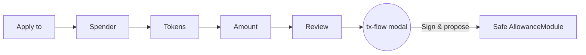
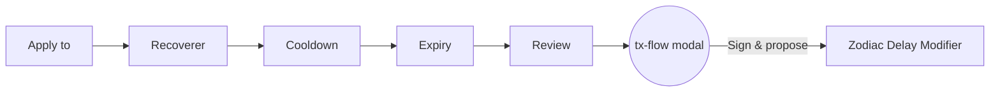
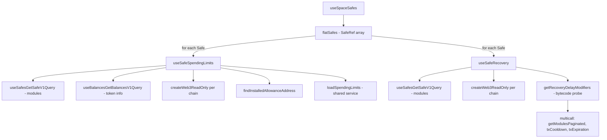

# Spaces → Policies

Workspace-level policies page that lets users **create**, **review**, and **manage** policies that govern every Safe in a Space.

> Branch: `feat/policies` · Lives at `apps/web/src/features/spaces/components/Policies/` · Route: `/spaces/policies`

---

## 1. Scope of this PR

What's in:

- **UI** for two policy wizards (Spending Limit, Account Recovery) and the **Active Policies** read view.
- **Batch transaction assembly**: each wizard's Review CTA builds a multi-send `MetaTransactionData[]` and hands it off to the standard Safe **tx-flow modal** (Safe Shield co-pilot, simulation, signer select, sign/propose). The wizard does **not** sign or submit directly.
- **Reuse of existing Safe services**: spending-limit reads come through the same `loadSpendingLimits` service the Safe Settings page uses; Delay Modifier reads come through `getRecoveryDelayModifiers`.

What's _not_ in this PR (called out where relevant below):

- A dedicated **token-price feed**. Per-token USD conversion in the Spending Limit wizard relies on `useBalancesGetBalancesV1Query` — only tokens the Safe currently holds get a live `fiatConversion`. Tokens with no balance fall through to manual amounts (see §3 step 3).
- Server-side persistence of policies. Everything is on-chain state, fetched fresh on each load (+ optional manual refresh).
- Editing existing policies. The drawer surfaces details and a per-token Remove; there's no "edit limit" flow yet — users remove + recreate.
- Operator Role policy type. Still a "Coming soon" tile.

---

## 2. URL map

| Route                                                    | What renders                     |
| -------------------------------------------------------- | -------------------------------- |
| `/spaces/policies`                                       | Tile grid + Active Policies list |
| `/spaces/policies?policy=spendingLimit&step=apply-to`    | Spending Limit wizard, step 1    |
| `/spaces/policies?policy=spendingLimit&step=wallet`      | Spending Limit wizard, step 2    |
| `/spaces/policies?policy=spendingLimit&step=tokens`      | Spending Limit wizard, step 3    |
| `/spaces/policies?policy=spendingLimit&step=amount`      | Spending Limit wizard, step 4    |
| `/spaces/policies?policy=spendingLimit&step=review`      | Spending Limit wizard, step 5    |
| `/spaces/policies?policy=accountRecovery&step=apply-to`  | Account Recovery wizard, step 1  |
| `/spaces/policies?policy=accountRecovery&step=recoverer` | Account Recovery wizard, step 2  |
| `/spaces/policies?policy=accountRecovery&step=cooldown`  | Account Recovery wizard, step 3  |
| `/spaces/policies?policy=accountRecovery&step=expiry`    | Account Recovery wizard, step 4  |
| `/spaces/policies?policy=accountRecovery&step=review`    | Account Recovery wizard, step 5  |

URL params are the source of truth for which step the wizard is on. The `?safe=eth:0x…` param is written **once** when the user taps Review — that's the only point where the global active-safe state is touched. The wizard itself maintains its own internal `selectedSafeKey` so picking a Safe in the Apply-to step doesn't churn the rest of the app (Topbar, sidebar, nested-safe nav stay untouched).

---

## 3. Spending Limit wizard

A 5-step wizard ending in a tx-flow modal hand-off.



### Step 1 — Apply to (`?step=apply-to`)

- Lists every Safe in the user's Space via `useSpaceSafes` (flattened across single + multi-chain entries).
- Each row shows the Safe identicon, name, short address, **chain logo**, and a selection checkbox.
- Component is shared with the Recovery wizard (`ApplyToStep` in `wizardCommon.tsx`).
- Continue activates once one Safe is selected.

### Step 2 — Spender (`?step=wallet`)

- **Any address can be the spender** — not restricted to Safe signers. A bot, an external wallet, or a teammate's EOA all work; the AllowanceModule has no signer constraint.
- Two fields, both backed by the shared `WizardField`:
  - **Spender address** — accepts `0x…` hex or `name.eth`. ENS resolution via `useNameResolver` with `Resolving…` / `✓ Valid` / red error states.
  - **Name** — optional, free text. Auto-fills from the user's address book if the resolved address is already known (via `useAddressBookItem`). When the user types a name for an unknown address, a "Save to address book" checkbox appears and (if checked) persists the entry on successful tx submission via `upsertAddressBookEntries`.
- Help card explains that withdrawals up to the limit need no further Safe approvals.

### Step 3 — Tokens (`?step=tokens`)

- Searchable list of tokens the Safe holds (sorted by held-balance > top of a chain-scoped fallback list), plus quick-pick pills (Stablecoins, Native, Clear) and a custom contract-paste row.
- Token selection drives the equivalent-amount calculation in step 4.

### Step 4 — Amount (`?step=amount`)

- A pill toggle at the top picks between **Recurring** and **One transaction**.
- Recurring → Day / Week / Month chooser appears; the underlying `period` is `'day' | 'week' | 'month'` and maps to `resetTimeMin` of `1440 / 10080 / 43200`.
- One transaction → period is `'once'` and maps to `resetTimeMin = 0` (the AllowanceModule's "single-use" allowance).
- A big `$` USD input drives the per-token equivalents shown below.

> **Token-price limitation.** The USD → token conversion uses each token's `fiatConversion` from `useBalancesGetBalancesV1Query` — the CGW endpoint that returns balances **and** their USD rate. If the Safe doesn't hold a particular token, no `fiatConversion` is returned and the wizard surfaces a per-token manual amount input instead. We **do not** call a price oracle directly. Coverage gaps in CGW's fiat conversion fall through to manual entry, which is functional but suboptimal UX.

### Step 5 — Review (`?step=review`)

- "Ready to sign?" hero summary + detail card listing Safe, Spender (with address-book name + cloud icon), Limits per period (or "One-time"), Enforced by, Signatures required, and the owner list.
- The CTA reads **Review**. Clicking it:
  1. Calls `useSubmitPolicy.buildTxs(...)` to assemble the multi-send batch (`enableModule` if not yet installed → `addDelegate` → `setAllowance` per token).
  2. Writes `?safe=eth:0x…` into the URL (shallow replace) so the modal targets the right Safe.
  3. Opens `<PolicyBatchFlow>` inside the standard tx-flow modal — the modal owns review, Safe Shield, simulation, and sign/propose.
- On the modal's success callback, the wizard saves any unsaved address-book entry, strips the wizard query params, and returns to the policies grid.

### Batch builder (`SpendingLimitFlow/buildBatch.ts`)

Pure function — easy to unit-test (8 tests in `__tests__/buildBatch.test.ts`).

- For deployed Safes that **don't** yet have the AllowanceModule enabled, the `enableModule(address)` call is encoded **directly** via `ethers.Interface` against the Safe address. The global Safe SDK singleton (`getSafeSDK()`) is no longer used, so the batch builds correctly for **any** Safe in the workspace without first switching the app's active-safe context.
- For counterfactual (undeployed) Safes, the existing `createEnableModuleTx(chain, safeAddress, safeVersion, …)` helper is used because version-specific master copies matter.
- `addDelegate` and `setAllowance` helpers come from `@/features/spending-limits/services/spendingLimitParams` unchanged.

---

## 4. Account Recovery wizard

A 5-step wizard that, at Review, builds the real Delay Modifier setup batch (deploy via the Zodiac factory + enable on the Safe + configure the recoverer + cooldown + expiry) and hands off to the tx-flow modal.



### Step 1 — Apply to (`?step=apply-to`)

Same shared `ApplyToStep` as Spending Limit.

### Step 2 — Recoverer (`?step=recoverer`)

- Same `WizardField` pair as the Spender step: address/ENS input + Name field + optional "Save to address book" toggle.
- Help card emphasises picking an address the user can always access (hardware wallet, trusted firm, another Safe they control).

### Step 3 — Cooldown (`?step=cooldown`)

- Vertical option list: 24h / 7d / 14d / 28d (**Recommended**) / 60d / Custom.
- Custom row swaps its description for an inline numeric input + "day(s)" suffix.
- Custom days are converted to seconds at Review time via `customCooldownDays * DAY_IN_SECONDS`.

### Step 4 — Expiry (`?step=expiry`)

- Vertical option list: Never (**Recommended**) / 6 months / 1 year / Custom date.
- The on-chain Delay Modifier `txExpiration` is a duration in seconds, not an absolute date. Custom dates are converted at Review time to `max(0, customDate - now)` seconds — a best-effort mapping of "this proposal expires by X date" to the contract's lifetime semantics.

### Step 5 — Review (`?step=review`)

- Gradient hero with a one-sentence summary interpolated from the data.
- Detail grid: Safe, Recoverer, Review window, Expires, Enforced by Safe Delay Modifier.
- Clicking **Review** mirrors Spending Limit:
  1. Maps `cooldown` / `expiry` to seconds (see `COOLDOWN_SECONDS` / `EXPIRY_SECONDS` constants).
  2. Creates a fresh per-chain `JsonRpcProvider` via `createWeb3ReadOnly(chain)` — does **not** rely on the global `web3ReadOnly` store so the build call works even though the wizard hasn't touched the app's active-safe state.
  3. Calls `getRecoveryUpsertTransactions(...)` from `@/features/recovery/services/setup` — the same service the existing standalone `UpsertRecovery` flow uses. Returns `MetaTransactionData[]`.
  4. Writes `?safe=eth:0x…` into the URL.
  5. Opens `<PolicyBatchFlow subtitle="Account recovery">` in the tx-flow modal.
- Address-book save runs on the modal's success callback, same pattern as Spending Limit.

> **Note.** The setup tx is a multi-step batch (`createProxy` for the Delay Modifier, `enableModule` on the Safe, `enableModule(recoverer)` on the Delay Modifier, `setTxCooldown` / `setTxExpiration`). All assembled in `getRecoveryUpsertTransactions` — we don't reimplement that here.

---

## 5. Tx-flow handoff (`PolicyBatch`)

`apps/web/src/components/tx-flow/flows/PolicyBatch/index.tsx`

A thin wrapper around the standard `TxFlow` that accepts a prebuilt `MetaTransactionData[]` via `initialData` and uses a small `PolicyBatchReview` component to hydrate `SafeTxContext` from the batch on mount:

```ts
useEffect(() => {
  if (!data?.txs?.length) return
  createMultiSendCallOnlyTx(data.txs).then(setSafeTx).catch(setSafeTxError)
}, [data, setSafeTx, setSafeTxError])
```

Once `setSafeTx` lands, the modal's standard ReviewTransactionV2 component renders with **all the regular features available** — Safe Shield (verified contract, threat scan, simulation), balance changes, fee preview, signer select, sign/propose. Nothing wizard-specific past this point.

The wrapper accepts a `subtitle` (e.g. "Spending limit") and an optional `icon`, plus an `onSubmit` callback that fires when the modal flow completes with a `txId`.

---

## 6. Active Policies

The page below the Add-a-policy tiles. Scans every Safe in the Space in parallel, renders one row per `(Safe × spender)` for spending limits and one row per `(Safe × recoverer)` for recovery.

### Header

```
ACTIVE POLICIES  3            5 safes scanned  ⟳
```

- **Left**: title + count (or `Scanning N safes…` with a pulsing dot while in-flight).
- **Right**: scanned-safes label + circular refresh button. Refresh works by bumping a `refreshNonce` integer that's part of the React key for each `<SafePolicies>` child → the child remounts → its `useAsync` hooks re-run.

### Row layout

Each row, top → bottom:

1. **Policy tag** — small uppercase green caps: `SPENDING LIMIT` or `ACCOUNT RECOVERY`.
2. **Spender / Recoverer** — identicon + address-book name (if known) + short address.
3. **Applied-to Safe** — `Safe: [identicon] Name eth:0x…  [chain logo]`.
4. **Detail line** — spending limit summary (`Limit: 100 USDC daily · 0.05 ETH weekly`) or recovery summary (`Cooldown: 28 days · never expires`).

Right-anchored: a pulsing **Active** pill + a subtle chevron that nudges right on hover. The whole row is `role="button"` with Enter/Space keyboard support and focus-visible outline.

Click → opens the **Policy Detail drawer** (see §7).

### Data flow



### `useSafeSpendingLimits(chainId, safeAddress)`

Returns `{ limits, delegates, hasAllowanceModule, moduleAddress, loading, error }`.

- Per-chain `JsonRpcProvider` via `createWeb3ReadOnly(chain)` (not the global one — that'd be wrong for cross-chain scans).
- `findInstalledAllowanceAddress(modules)` matches each of the Safe's modules against every known AllowanceModule deployment address (v0.1.0 + v0.1.1, across every chain in the deployment JSON). Avoids the v0.1.1-on-mainnet gap in `deployment.networkAddresses["1"]`.
- **Loader reuse**: the actual limit enumeration goes through `loadSpendingLimits` from `@/features/spending-limits/services/spendingLimitLoader` — the **same service** the Safe Settings page uses. Single source of truth.
- Errors are caught and logged via the standard `logError(Errors._609, …)` channel; the listing degrades to `limits: []` rather than crashing.

### `useSafeRecovery(chainId, safeAddress)`

Returns `{ recovery: SafeRecoveryConfig[], loading }`.

- Same per-chain provider setup.
- Probes each module's bytecode via `getRecoveryDelayModifiers` to confirm it's an official Zodiac Delay.
- For each detected Delay Modifier, multicalls `getModulesPaginated(SENTINEL, 100)` + `txCooldown` + `txExpiration`. If any sub-call reverts, the modifier is skipped (partial config is worse than dropping the row). Errors are caught and logged via `logError(Errors._812, …)`.

### Robustness fix in `spendingLimitLoader.ts`

The shared loader was patched to **skip failed multicall sub-calls** instead of blindly decoding empty `0x` returnData (which crashes ethers with `invalid bytes32 – not 32 bytes long`). Both consumers (Settings page, Active Policies list) benefit.

```ts
const decoded = results
  .map((result, index): DecodedAllowance | null => {
    if (!result.success || !result.returnData || result.returnData === '0x') return null
    try {
      const tokenAllowance = contract.interface.decodeFunctionResult('getTokenAllowance', result.returnData)[0]
      return { index, tokenAllowance }
    } catch {
      return null
    }
  })
  .filter((entry): entry is DecodedAllowance => entry !== null)
```

### Fallback rendering

The row + count are kept in sync three ways:

1. **Full data path** — spender + tokens enumerated. Row's detail line shows `Limit: …`.
2. **Delegate known, tokens unknown** — happens when `getDelegates` returns a delegate but `getTokens` for that delegate reverts (e.g., setup tx not yet executed). One row per delegate with `No active token limits — setup may be pending execution.`
3. **Module installed, no delegates at all** — fallback row keyed by the Safe itself. `Module installed · spender details unavailable`.

Clicking any tier opens the drawer; tier-2 and tier-3 surfaces show graceful "not yet readable" copy.

---

## 7. Policy Detail drawer

`PolicyDetailDrawer.tsx`

Right-anchored 480px MUI Drawer styled to match the wizard's Policy Summary card. Section labels in small uppercase grey + value on the right + thin dividers.

**Spending Limit drawer**:

- **From** — Safe identicon, name, prefixed address, chain logo
- **Spender** — identicon, name (from address book), short address (or "Details unavailable" in the tier-3 fallback)
- **Per {cadence}** — one inline token row per limit: token logo + symbol + amount (right-aligned), thin spent/limit progress bar, `X spent · resets Tomorrow` line, trash button. Bar turns amber at 50%, red at 90%.
- **Resets** — cadence label
- **Footer** — `Enforced by Safe Allowance Module` chip + outlined "Manage on Safe" button

**Recovery drawer**:

- **From** + **Recoverer** rows (same pattern)
- **Cooldown** — clock icon + duration
- **Expires** — calendar icon + "Never" / duration
- **Module** — monospace address of the Delay Modifier
- **Footer** — `Enforced by Safe Delay Modifier` chip + outlined "Manage on Safe" button

The per-token trash button opens the canonical `RemoveSpendingLimitFlow` — same as the Safe Settings page — after shallow-replacing the URL with the right `?safe=` so the underlying `useSafeInfo` lands correctly.

---

## 8. Shared primitives (`wizardCommon.tsx`)

| Export             | Role                                                                        |
| ------------------ | --------------------------------------------------------------------------- |
| `WizardLayout`     | The three-column shell (stepper / form / summary) used by both wizards      |
| `VerticalWizard`   | Numbered step indicator with connector lines                                |
| `FormHeader`       | Back + Review/Continue header inside the form card                          |
| `WizardField`      | Icon + input row with consistent rest/hover/focus/valid/error states        |
| `ApplyToStep`      | Safe-picker step — used by both wizards                                     |
| `OptionCard`       | Radio-list row (Cooldown, Expiry); supports inline `description: ReactNode` |
| `PolicySummaryRow` | One row in the right-column summary; pending state fades to 0.45 opacity    |
| `SelectionCheck`   | Squarish checkmark for row-pickers                                          |
| `safeKey`          | Canonical `chainId:address` key helper                                      |
| `SafeRowItem`      | Type for a row in the Apply-to step                                         |

---

## 9. File structure

```
apps/web/src/features/spaces/components/Policies/
├── index.tsx                          ← entry; tile grid + routes to wizards
├── Page.tsx                           ← page-level wrapper
├── AppliedPolicies.tsx                ← Active Policies list + refresh
├── PolicyDetailDrawer.tsx             ← side-panel detail view
├── wizardCommon.tsx                   ← shared layout + primitives
├── useSafeSpendingLimits.ts           ← per-Safe spending-limit reader
├── useSafeRecovery.ts                 ← per-Safe recovery reader
├── SpendingLimitFlow/
│   ├── index.tsx                      ← 5-step wizard
│   ├── buildBatch.ts                  ← multi-send batch builder
│   ├── tokenList.ts                   ← chain-scoped fallback token list
│   ├── useSubmitPolicy.ts             ← buildTxs hook (no signing)
│   └── __tests__/
│       └── buildBatch.test.ts
├── RecoveryFlow/
│   └── index.tsx                      ← 5-step wizard
└── __tests__/
    └── index.test.tsx
```

Plus:

- `apps/web/src/components/tx-flow/flows/PolicyBatch/index.tsx` — prebuilt-batch tx-flow
- `apps/web/src/pages/spaces/policies.tsx` — Next.js route
- `apps/web/src/features/spending-limits/services/spendingLimitLoader.ts` — shared loader (robustness patch)

---

## 10. Known limitations

### Token prices

Per-token USD conversion in the Spending Limit wizard is sourced from `useBalancesGetBalancesV1Query` — CGW only returns `fiatConversion` for tokens the Safe holds. The wizard degrades gracefully (falls through to per-token manual entry) but a user setting a spending limit for a token the Safe doesn't yet hold has to enter the token amount themselves.

A dedicated price feed (CoinGecko, an internal pricing service, or pulling rates from the Cowswap quote endpoint) is the natural follow-up.

### Custom delay seconds

The Recovery wizard's Custom expiry date is mapped to a duration via `customDate - now`. The on-chain Delay Modifier `txExpiration` is a duration in seconds (how long a queued recovery proposal stays executable), not an absolute deadline. The wizard's UI (pick a date) doesn't perfectly map onto this semantic; we approximate with "remaining time until that date". For most users the simpler "Never / 6m / 1y" presets are the right call.

### Multi-chain Safes

`flattenSafes` expands a multi-chain Safe entry into one row per chain. A Safe with the same address on 3 chains is scanned (and may appear) 3 times in the Apply-to list. Each chain is treated as an independent target.

### Custom AllowanceModule deployments

`findInstalledAllowanceAddress` only matches against the addresses in `@safe-global/safe-modules-deployments`. A Safe with a self-deployed, non-canonical AllowanceModule won't be detected.

### URL safe-context for the per-token delete

The drawer's Trash button writes `?safe=eth:0x…` via `window.history.replaceState` before opening `RemoveSpendingLimitFlow`. On slow networks the modal may render briefly before `safeInfoSlice` finishes loading — not breaking, just a faint flash.

### No bulk remove

The drawer's only destructive action is per-token Remove. There's no "remove all limits for this spender" or "remove the AllowanceModule" affordance — those flows live on the Safe Settings page (linked via the "Manage on Safe" button).

---

## 11. Follow-ups

1. **Token price feed** — wire a dedicated rate source so the Spending Limit wizard always has fiat conversion (see §10).
2. **Operator Role policy type** — currently inert "Coming soon" tile.
3. **Edit-in-place** for spending limits — change amount or reset window without remove + recreate.
4. **Storybook stories** for the wizard steps + drawer in all states (full data, fallback, error).
5. **Cypress E2E** for the end-to-end flow (build batch → Safe Shield modal → sign mock).
6. **`aria-current="step"`** on the active wizard step in `VerticalWizard`.
7. **Mobile breakpoints** — both wizards collapse to single-column on `xs`, untested under realistic mobile viewports.

---

## 12. Backend touchpoints

| Source                                                                        | What we read                                           |
| ----------------------------------------------------------------------------- | ------------------------------------------------------ |
| `useSpaceSafes` (CGW)                                                         | Space's Safe list                                      |
| `useSafesGetSafeV1Query` (CGW)                                                | Per-Safe modules, owners, threshold, version           |
| `useBalancesGetBalancesV1Query` (CGW)                                         | Token metadata + `fiatConversion` for held tokens      |
| `createWeb3ReadOnly(chain)` (Infura)                                          | Per-chain JSON-RPC provider                            |
| `AllowanceModule.getDelegates`, `.getTokens`, `.getTokenAllowance` (on-chain) | Spending limit state                                   |
| `Delay.getModulesPaginated`, `.txCooldown`, `.txExpiration` (on-chain)        | Recovery configuration                                 |
| Zodiac bytecode probe (on-chain)                                              | Distinguish official Delay Modifier from other modules |
| `useAllAddressBooks` (local store + CGW space contacts)                       | Spender / Recoverer names                              |
| `useNameResolver` (web3 read-only + ENS)                                      | ENS → 0x resolution                                    |

---

_Last updated: 2026-05-27_
