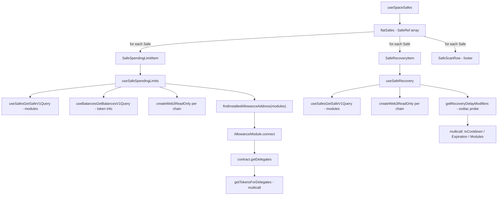

# Spaces → Policies

Workspace-level policies page that lets users **create** (Spending Limit, Account Recovery) and **audit** policies applied to every Safe in a Space.

> Branch: `policies` · Lives at `apps/web/src/features/spaces/components/Policies/` · Route: `/spaces/policies`

---

## 1. What this ships

A new page at `/spaces/policies` with three sections:

1. **Header** — Page title and one-line description.
2. **Add a policy** — A 3-tile grid (Spending Limit, Operator Role · _coming soon_, Account Recovery). Clicking a non-soon tile opens its wizard.
3. **Active policies** — A live-scanning list of every policy already applied across the Safes in the current Space. Each entry is a compact tappable row that expands to show its full configuration.

Two wizards are reachable from the **Add a policy** tiles:

- **Spending Limit wizard** — 4 steps, replaces the old single-card flow on this branch with a 3-column shell.
- **Account Recovery wizard** — 5 steps, brand new on this branch.

Both wizards share a common 3-column shell:

| Column | Width        | Role                                                                               |
| ------ | ------------ | ---------------------------------------------------------------------------------- |
| Left   | 200 px       | Vertical step indicator with dark filled circle for current/done steps             |
| Center | flex (min-0) | The active step's form, with **Back** / **Continue** at the top                    |
| Right  | 340 px       | Sticky **Policy summary** card — fills progressively as the user answers each step |

---

## 2. Where to look (URL map)

| Route                                                            | What renders                        |
| ---------------------------------------------------------------- | ----------------------------------- |
| `/spaces/policies`                                               | Tile grid + Active policies section |
| `/spaces/policies?policy=spendingLimit&safe=eth:0x…&step=wallet` | Spending Limit wizard, step 1       |
| `/spaces/policies?policy=spendingLimit&safe=eth:0x…&step=tokens` | Spending Limit wizard, step 2       |
| `/spaces/policies?policy=spendingLimit&safe=eth:0x…&step=amount` | Spending Limit wizard, step 3       |
| `/spaces/policies?policy=spendingLimit&safe=eth:0x…&step=review` | Spending Limit wizard, step 4       |
| `/spaces/policies?policy=accountRecovery&step=apply-to`          | Recovery wizard, step 1             |
| `/spaces/policies?policy=accountRecovery&step=recoverer`         | Recovery wizard, step 2             |
| `/spaces/policies?policy=accountRecovery&step=cooldown`          | Recovery wizard, step 3             |
| `/spaces/policies?policy=accountRecovery&step=expiry`            | Recovery wizard, step 4             |
| `/spaces/policies?policy=accountRecovery&step=review`            | Recovery wizard, step 5             |

URL params are **the source of truth** for which step the wizard is on. Refreshing keeps the user on the same step. The `safe` query param can be used to inject Safe context into the page — required for the per-limit delete flow.

---

## 3. Spending Limit wizard — step by step

Entry: clicking the **Spending Limit** tile dispatches `openSafeActionsModal` → user picks a Safe from the modal → URL gains `?policy=spendingLimit&safe=…` → wizard renders.

### Step 1 — **Spender** (`?step=wallet`)

- Title: "Who gets this limit?"
- Lists the Safe's signers (owners) as selectable rows.
- One must be picked before **Continue** activates.
- **Back** label reads **Policies** on this first step — clicking strips `?policy=` + `?step=` from the URL and returns to the tile grid.

### Step 2 — **Tokens** (`?step=tokens`)

- Title: "Which tokens?"
- Searchable, sorted list of tokens the Safe holds (priority order: held balances → top of a static Uniswap list → custom contract-paste).
- Quick-pick pills: **Stablecoins**, **Native**, **Clear**.
- Custom token entry: paste a contract address; appears as a dashed "Add custom token" row.
- **Continue** activates once ≥1 token is selected.

### Step 3 — **Amount** (`?step=amount`)

- Title: "How much, how often?"
- Single-column layout: big `$` USD input + a compact `Day` / `Week` / `Month` segmented control on the same row, then an **Equivalent** card listing per-token conversions.
- Default amount is **`0`** (not 5000 — see commit `15163442a`).
- For unpriced tokens, the user enters a per-token amount instead of relying on the USD conversion.
- **Continue** activates once every picked token has a usable amount (priced → `amount > 0`; unpriced → manual entry > 0).

### Step 4 — **Review** (`?step=review`)

- Title: "Ready to sign?"
- Single-column detail card: Safe, Spender (renamed from "Wallet"), Limits per period, Enforced by, Signatures required, owner list.
- Submits via `useSubmitPolicy` (a real on-chain submission building a multisig tx using the AllowanceModule).

### Right-column Policy summary (all steps)

Rows fill progressively. The label "Per {period}" updates to reflect the chosen period. The "Resets" row stays at `—` until the user actually types a value (default-state guard, commit `pre-15163`).

| Row          | Becomes visible when…          | Source                                                      |
| ------------ | ------------------------------ | ----------------------------------------------------------- |
| From         | Always                         | Safe URL prefix + address                                   |
| Spender      | A signer is selected on step 1 | `delegate` state                                            |
| Per {period} | A token is picked on step 2    | Computed per-token amount, formatted with `safeFormatUnits` |
| Resets       | Amount entered on step 3       | `PERIOD_LABELS[period]`                                     |

---

## 4. Account Recovery wizard — step by step

Entry: clicking the **Account Recovery** tile pushes `?policy=accountRecovery` into the URL.

### Step 1 — **Apply to** (`?step=apply-to`)

- Title: "Which Safe does this apply to?"
- Lists every Safe in the user's Space (`useSpaceSafes` → flattened across single + multi-chain entries).
- Each row uses the same primitives as the Accounts page (`SafeIdenticon` + `ShortAddressWithTooltip` + `CopyAddressButton`).
- `SelectionCheck` indicates the picked Safe.

### Step 2 — **Recoverer** (`?step=recoverer`)

- Title: "Who can recover this Safe?"
- Two fields:
  - **Recoverer address** — accepts 0x hex or ENS. ENS is debounced + resolved via `useNameResolver` (same hook the production `AddressInput` uses). Renders three states:
    - `Resolving…` pill with spinner while ENS is in flight
    - `✓ Valid` pill + monospace "Resolves to `0xd8dA…6045`" sub-line on success
    - Red "Enter a valid address or ENS." after resolution finishes with no match
  - **Nickname** — optional, free text, shown later in the Policies overview.
- A tip card reminds: "Pick an address you can always access" (hardware wallet, trusted law firm, another Safe).
- **Continue** activates once the resolved address is valid.

### Step 3 — **Cooldown** (`?step=cooldown`)

- Title: "How long is the review window?"
- Vertical radio-list of 6 options: 24h, 7d, 14d, 28d (**Recommended**), 60d, **Custom**.
- The `Custom` row swaps its description for an inline numeric input + "day(s)" suffix when selected.
- **Continue** activates once a preset is picked, or when the Custom value is `> 0`.

### Step 4 — **Expiry** (`?step=expiry`)

- Title: "When does this expire?"
- Vertical radio-list of 4 options: **Never** (**Recommended**), 6 months, 1 year, **Custom date**.
- The `Custom date` row swaps its description for a native `<input type="date">`, locked to "tomorrow or later" via `min=`.
- **Continue** activates once a preset is picked, or when the Custom date is a valid future date.

### Step 5 — **Review** (`?step=review`)

- Title: "Ready to sign?"
- Green gradient hero with a one-sentence summary built from the data:
  > **{recoverer name or short addr}** can recover **{Safe name}**. They can propose a signer rotation, which executes after a **{cooldown}** review window. This option **{never expires / expires after 1 year / expires on Apr 17, 2027}**.
- Below: 2×2 detail grid (Safe, Recoverer, Review window, Expires) + an "Enforced by Safe Delay Modifier" footer.

> ⚠️ **The Recovery wizard's `Sign & create` is currently a stub.** It waits 600 ms then returns to the policies grid. Deploying a Delay Modifier and enabling it on the Safe is **not implemented in this PR.**

---

## 5. Active Policies — live data flow

This is the production read-path. It scans **every Safe in the current Space in parallel** and renders a row per `(Safe × policy type)` pair that has real on-chain state.



### `useSafeSpendingLimits(chainId, safeAddress)`

Returns `{ limits, loading, error, hasAllowanceModule }`.

Internals:

1. **Chain config** via `useChains` → match by chainId.
2. **Per-chain JSON-RPC provider** via `createWeb3ReadOnly(chain)`. Not `useWeb3ReadOnly()` — that's the globally-selected chain's provider, which is wrong when iterating Safes on different chains.
3. **Safe info** via `useSafesGetSafeV1Query` for the modules array.
4. **Balances** via `useBalancesGetBalancesV1Query` for token metadata (decimals, symbol, logoUri). Not used to gate the loader — Safes can hold spending limits for tokens they no longer hold any balance of.
5. **Address resolution** — `findInstalledAllowanceAddress(modules)` walks the Safe's own modules array and checks each against the **full set** of known AllowanceModule addresses (v0.1.0 + v0.1.1 across all chains in the deployment JSON). Returns the **exact address from the Safe** so the address is guaranteed to have bytecode.
6. **`contract.getDelegates(safeAddress, 0, 100)`** → list of delegate addresses (spenders).
7. **`getTokensForDelegates(contract, provider, safeAddress, delegates, tokenInfo)`** → batched multicall fetching every (delegate, token) tuple and its allowance state.
8. Filters out "zero allowance + one-time" stubs (mirrors upstream).

### `useSafeRecovery(chainId, safeAddress)`

Returns `{ recovery: SafeRecoveryConfig[], loading, error }`.

Internals:

1. Same per-chain provider setup as above.
2. **`getRecoveryDelayModifiers(chainId, modules, provider)`** — probes each module's bytecode through any proxy chain to confirm it's an official Zodiac Delay.
3. For each detected Delay Modifier:
   - Multicalls `getModulesPaginated(SENTINEL_ADDRESS, 100)` → recoverers list.
   - Multicalls `txCooldown` → seconds.
   - Multicalls `txExpiration` → seconds (0 = never).

### Why a row appears even when limits are empty

If `hasAllowanceModule` resolves true but `limits.length === 0` (or the loader errors), the row still renders. Three visible states:

1. **Working** — `Spending Limit · 2 spenders, 4 tokens` (+ expand shows real beneficiary blocks)
2. **Module enabled, no spenders** — `Spending Limit · module enabled · no spenders` (+ expand shows a quiet explainer)
3. **Failed to load** — `Spending Limit · failed to load` (+ expand shows a red box with the actual error message)

This makes silent failures visible.

### Scan completion tracking

Each child component reports back to the parent via `onAppliedChange(key, isApplied)`. The parent maintains a `Map<string, boolean>` and computes:

- `expectedScans = flatSafes.length * 2` (one for spending limits, one for recovery)
- `completedScans = scanStatuses.size`
- `stillScanning = spacesLoading || completedScans < expectedScans`

To avoid a "premature completion" race on the first render (before `useAsync`'s `useEffect` flips `loading` to true), both hooks track an internal `asyncAttempted` flag set inside the async callback's `finally`. The hook's returned `loading` stays `true` until either:

- The Safe has zero modules (deterministically nothing to find), **or**
- The async callback has actually fired and finished.

### Scanned-safes diagnostic footer

Below the active-policies list, a fold-out **Scanned N safes in this space** section lists every Safe with:

- Identicon + name + short address
- Module count (`0 modules` / `2 modules`)
- An `ALLOWANCE` badge when `findInstalledAllowanceAddress` matches one of the Safe's modules
- An `OTHER MODULE` badge when the Safe has modules beyond the AllowanceModule (e.g., a Delay Modifier)

The footer **auto-expands** when 0 policies are found, so the user can immediately see what was checked and reason about why nothing showed up.

---

## 6. File structure

```
apps/web/src/features/spaces/components/Policies/
├── index.tsx                     ← SpacePolicies entry; renders tiles or routes to a wizard
├── Page.tsx                      ← page-level wrapper
├── AppliedPolicies.tsx           ← Active policies section + scan footer
├── wizardCommon.tsx              ← shared primitives (VerticalWizard, FormHeader, OptionCard, …)
├── useSafeSpendingLimits.ts      ← per-Safe spending-limit loader + findInstalledAllowanceAddress
├── useSafeRecovery.ts            ← per-Safe recovery loader
├── SpendingLimitFlow/
│   ├── index.tsx                 ← 4-step wizard
│   ├── buildBatch.ts             ← AllowanceModule tx builder
│   ├── tokenList.ts              ← chain-scoped fallback token list
│   └── useSubmitPolicy.ts        ← submission hook (real, multisig)
├── RecoveryFlow/
│   └── index.tsx                 ← 5-step wizard (submit is stubbed)
└── __tests__/
    └── index.test.tsx
```

Plus the page route:

```
apps/web/src/pages/spaces/policies.tsx
```

And a sidebar nav entry in:

```
apps/web/src/features/spaces/components/Sidebar/config/index.tsx
```

---

## 7. Shared primitives (`wizardCommon.tsx`)

| Component           | Role                                                                                                                    |
| ------------------- | ----------------------------------------------------------------------------------------------------------------------- |
| `VerticalWizard`    | Numbered step indicator with connector lines. Filled (dark) for current + completed.                                    |
| `FormHeader`        | Back + Continue/Sign at the top of each form card. On step 1, Back reads "Policies" and exits the wizard.               |
| `PolicySummaryRow`  | A single row in the right-column summary. Dim 0.45 opacity when `pending`.                                              |
| `SelectionCheck`    | The squarish checkmark used in row-pickers (signers, Safes).                                                            |
| `selectedRowStyles` | sx tokens applied to a Paper row to indicate selection.                                                                 |
| `OptionCard`        | Radio-list row used by Cooldown + Expiry; supports a `description: ReactNode` slot so callers can inject inline inputs. |

---

## 8. Submission flows

### Spending Limit

`useSubmitPolicy` builds a Safe transaction that, for each (token, amount, delegate, period) tuple, calls either:

- `enableModule(allowanceModule)` if the AllowanceModule isn't already enabled, **and**
- `setAllowance(delegate, token, amountInBase, resetTimeMin, resetBaseMin)` on the module.

These are batched as a single Safe multi-send and routed through the normal queue → sign → execute flow.

### Recovery (stub)

`RecoveryFlow.submitPolicy` is intentionally a stub:

```ts
await new Promise((r) => setTimeout(r, 600))
const { policy: _p, step: _s, ...rest } = router.query
void router.replace({ pathname: AppRoutes.spaces.policies, query: rest })
```

A real implementation would:

1. Deploy a new Zodiac Delay Modifier with the chosen `txCooldown` + `txExpiration`.
2. Build a Safe transaction calling `enableModule(delayModifier)` on the Safe.
3. Add the recoverer address as a module on the Delay Modifier (`enableModule(recoverer)` on the Delay).
4. Route through the multisig queue → sign → execute flow.

This is **not** in scope for this PR.

---

## 9. Delete spending limit (canonical flow)

Each limit row inside an expanded Spending Limit policy has a trash icon. Clicking it:

1. Stops propagation (so the row doesn't collapse).
2. Calls `router.replace({ pathname, query: { ...router.query, safe: `${shortName}:${safeAddress}` } }, undefined, { shallow: true })`. This injects the target Safe into the URL so `useLoadSafeInfo` populates `safeInfoSlice` — `RemoveSpendingLimitFlow` reads `useSafeInfo()` internally.
3. `setTxFlow(<RemoveSpendingLimitFlow spendingLimit={limit} />)` opens the canonical modal flow.

The user signs and executes the removal in the standard Safe tx flow.

---

## 10. The "invalid bytes32" bug (fixed)

For QA awareness — this came up while building the Active policies view and is **fixed** by this PR.

**Symptom:** Spending Limit row showed `Spending Limit · failed to load` with the error `invalid bytes32 – not 32 bytes long`.

**Root cause:** The user's Safe had AllowanceModule **v0.1.1** at `0xAA46724893dedD72658219405185Fb0Fc91e091C` on mainnet. The shared `getSpendingLimitContract` does `deployment.networkAddresses["1"]` with **no fallback**, but the v0.1.1 deployment JSON has no `"1"` entry — so the lookup returned `undefined`, ethers built a contract pointing at no address, the RPC call returned empty bytes, and ABI decoding failed.

**Fix:** `findInstalledAllowanceAddress(modules)` finds the address **from the Safe's own modules array** by matching against every known AllowanceModule address (across both versions and every registered chain). The returned address is guaranteed to have bytecode on the chain we're calling.

The badge in the scan footer uses the same helper, so the detection logic and the loader logic can never disagree.

---

## 11. QA test cases

### Tiles + navigation

- [ ] Visiting `/spaces/policies` with no `?policy=` param shows the tile grid and (if any) Active policies section.
- [ ] Clicking **Spending Limit** opens the Safe-picker modal first.
- [ ] Clicking **Account Recovery** navigates to `?policy=accountRecovery&step=apply-to`.
- [ ] **Operator Role** tile is dimmed with a green pulsing "Coming soon" pill and ignores clicks.
- [ ] Refreshing the page while on any wizard step keeps the user on the same step.

### Spending Limit wizard

- [ ] Step 1 lists every signer of the Safe; only one can be selected at a time.
- [ ] Back on step 1 reads "Policies" and exits the wizard.
- [ ] Step 2 quick-pick pills (Stablecoins / Native / Clear) work.
- [ ] Step 2 custom-address paste appends a row labelled "Custom".
- [ ] Step 3 default amount is `0` (right-column "Per {period}" row stays at "—").
- [ ] Step 3 period segmented control changes the right-column "Per {period}" label.
- [ ] Step 3 unpriced tokens render their own input; Continue stays disabled until every picked token has a usable amount.
- [ ] Step 4 detail card matches the right-column summary.
- [ ] Submitting on step 4 routes to the standard Safe queue (do not actually submit unless intentional).

### Recovery wizard

- [ ] Step 1 lists every Safe in the Space (use `useSpaceSafes`); multi-chain Safes appear once per chain.
- [ ] Step 2 typing `vitalik.eth` shows `Resolving…` then `✓ Valid` and a "Resolves to 0xd8dA…6045" sub-line.
- [ ] Step 2 typing garbage shows the red error **only after** resolution settles (no flicker mid-typing).
- [ ] Step 3 Custom row reveals a number input; entering `42` updates the right-column summary to "42 days".
- [ ] Step 4 Custom date row reveals a native date picker; the `min` attribute prevents picking today or earlier.
- [ ] Step 5 gradient hero interpolates the resolved recoverer name (or short addr), Safe name, cooldown label, and expiry verb correctly.
- [ ] Clicking **Sign & create** on step 5 waits ~600 ms then returns to the policies grid (stub).

### Active policies

- [ ] A Safe with an AllowanceModule installed shows a row labelled `Spending Limit · N spenders, M tokens`.
- [ ] Tapping the row expands it; each spender block shows identicon + (address-book name if any) + per-token rows with `spent / amount` and reset time.
- [ ] An installed AllowanceModule with no delegates shows `Spending Limit · module enabled · no spenders` and an explainer in the expanded view.
- [ ] An installed AllowanceModule that errors at runtime shows `Spending Limit · failed to load` and the error inside a red box on expand.
- [ ] A Safe with a Zodiac Delay Modifier shows `Account Recovery · N recoverers, X days review`; expanding reveals the cooldown / expiry tiles + recoverer list.
- [ ] **Active policies** header reads `Scanning N safes…` with a pulsing dot while any per-Safe scan is in flight; flips to a count once everything settles.
- [ ] When zero policies are found, a dashed empty-state card appears: "No policies applied to the N safes in this space yet."
- [ ] The **Scanned N safes in this space** footer:
  - Lists every Safe with module count + `ALLOWANCE` and/or `OTHER MODULE` badges.
  - Auto-expands when no active policies were found.

### Delete limit

- [ ] Clicking the trash icon on a limit row injects `?safe=eth:0x…` into the URL **without** leaving the policies page.
- [ ] The canonical `RemoveSpendingLimitFlow` modal opens with the right spending limit pre-filled.
- [ ] Cancelling the modal leaves the row intact.

### Address book integration

- [ ] When the Spender or Recoverer address has an entry in the user's address book (space or local), the row shows the **name** above the short address.
- [ ] When there's no entry, only the short address shows — no awkward blank line.

### Visual

- [ ] Active-policy rows use the **blocky `SafeIdenticon`** (not letter avatars) — same as the Accounts page.
- [ ] No copy buttons inside expanded views (intentional — addresses still have hover-tooltip via `ShortAddressWithTooltip`).
- [ ] The Active section reads "ACTIVE POLICIES" (uppercase) with the count next to it.
- [ ] The Add a policy section is **below** the Active section.

---

## 12. Edge cases & limitations

### Multi-chain Safes

`flattenSafes` expands a `MultiChainSafeItem` into one `SafeRef` per chain. This means a Safe with the same address on 3 chains is scanned 3 times — once per chain — and could surface as 3 separate rows if it has policies on each.

### Custom AllowanceModule deployments

`findInstalledAllowanceAddress` only matches against the SDK's `safe-modules-deployments` package. A Safe with a self-deployed, non-canonical AllowanceModule **will not be detected**. The row won't render and the badge in the scan footer won't appear.

### Recovery: legitimate non-recovery Delay Modifiers

`getRecoveryDelayModifiers` filters out Delay Modifiers whose enabled modules include any other Zodiac contract — heuristic for "this is a Roles / Scope setup, not recovery". A Delay Modifier with mixed-use modules might be misclassified.

### Stub submission

The Recovery wizard's submission is a no-op stub. Do not click "Sign & create" expecting a real recovery setup. (Wired up in a future PR.)

### URL safe-context for delete

The trash button does `router.replace(..., { shallow: true })`. On slow networks, the `RemoveSpendingLimitFlow` modal might open a moment before `safeInfoSlice` finishes loading — the modal will show a loading state until it settles. Not breaking, just a subtle flash.

### Custom days/date thread-through

The Cooldown's custom days and Expiry's custom date are stored in component state and surfaced in the summary, but **are not yet threaded into a real submission payload**. Since the submit is stubbed anyway, this is internally consistent — but worth flagging for when the real submission lands.

### Operator Role tile

Visually present, dimmed with "Coming soon" pulse. No click handler — completely inert.

---

## 13. Accessibility

- All collapsible rows have `role="button"` and `aria-expanded`.
- The trash icon button has `aria-label="Remove spending limit"`.
- The custom date input has `aria-label="Custom expiry date"`; the custom days input has `aria-label="Custom number of days"`.
- The wizard's vertical step indicator does not currently expose step state to AT — known gap; consider an `aria-current="step"` follow-up.

---

## 14. Backend touchpoints

| Source                                                                        | What we read                                           |
| ----------------------------------------------------------------------------- | ------------------------------------------------------ |
| `useSpaceSafesGetV1Query` (CGW)                                               | Space's Safe list                                      |
| `useSafesGetSafeV1Query` (CGW)                                                | Per-Safe modules, owners, threshold                    |
| `useBalancesGetBalancesV1Query` (CGW)                                         | Token metadata for displaying limit amounts            |
| `createWeb3ReadOnly(chain)` (Infura)                                          | Per-chain JSON-RPC provider                            |
| `AllowanceModule.getDelegates`, `.getTokens`, `.getTokenAllowance` (on-chain) | Spending limit state                                   |
| `Delay.getModulesPaginated`, `.txCooldown`, `.txExpiration` (on-chain)        | Recovery configuration                                 |
| Zodiac `ContractVersions` + `_getZodiacContract` bytecode probe (on-chain)    | Distinguish official Delay Modifier from other modules |
| `useAllAddressBooks` (local store + CGW space contacts)                       | Spender / Recoverer names                              |
| `useNameResolver` (web3 read-only + ENS)                                      | ENS → 0x resolution                                    |

---

## 15. Known follow-ups

1. **Wire Recovery submission** — deploy Delay Modifier + enable it on the Safe.
2. **Persist custom cooldown seconds and expiry timestamps** in the submission payload.
3. **Operator Role wizard** when product is ready.
4. **Refactor `getSpendingLimitContract`** upstream to use the CREATE2 fallback that `findInstalledAllowanceAddress` already provides — would let the existing settings page benefit from the same robustness.
5. **`aria-current="step"`** on the active wizard step.
6. **Mobile breakpoints** — wizards collapse to single-column on `xs`, untested under realistic mobile viewports.
7. **Storybook** — wizard steps have no stories yet.

---

_Last updated: 2026-05-17_
