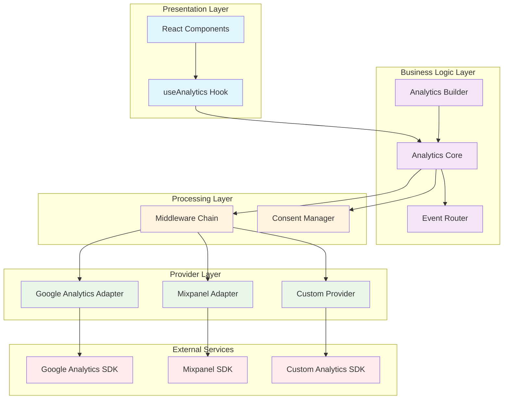
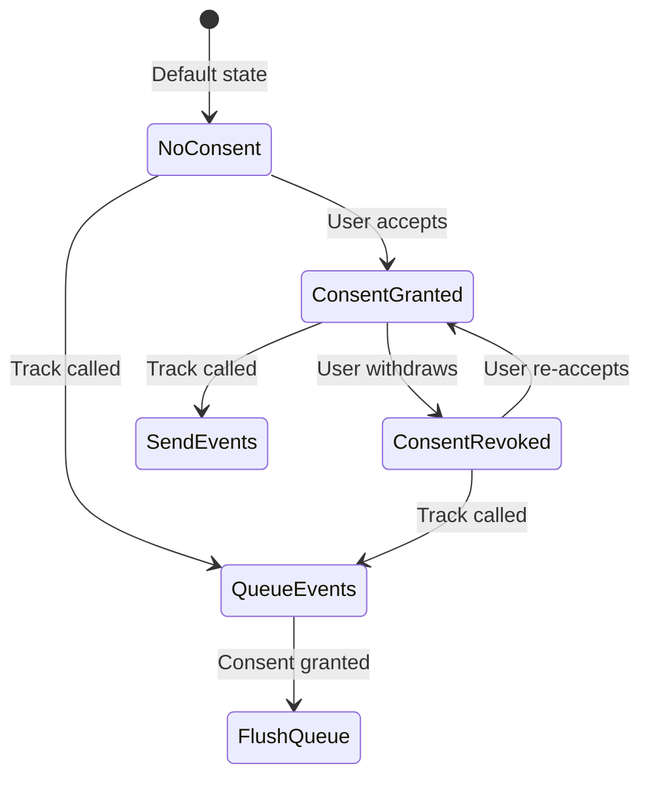
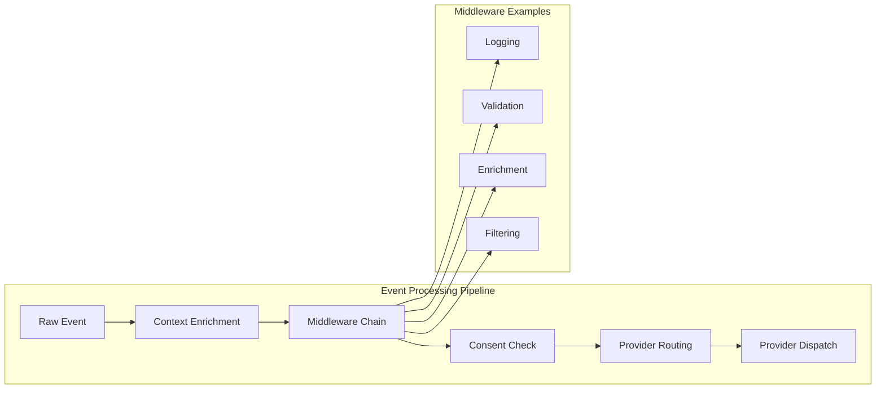
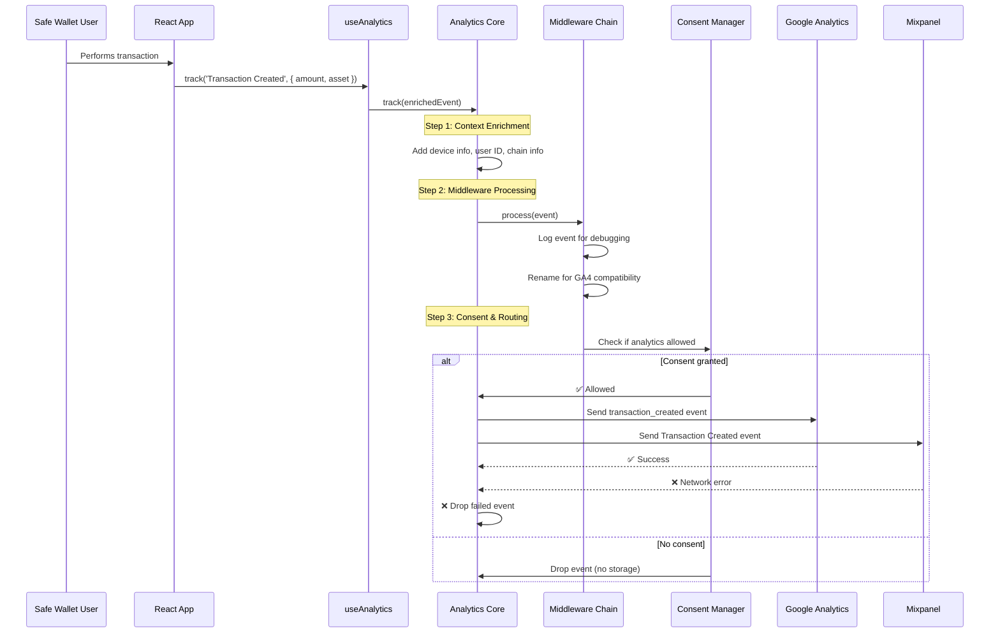

# Safe Wallet Analytics Architecture

This document outlines the comprehensive analytics architecture for Safe Wallet, implementing enterprise-grade event tracking with privacy compliance, type safety, and extensibility.

## Architecture Overview

The analytics system follows a **layered architecture** with clear separation of concerns, implementing multiple design patterns for scalability and maintainability.



### Core Components

#### 1. Analytics Core (`analytics.ts`)

**Design Patterns:** Composite + Mediator + Command

Central orchestrator managing providers, middleware, and event flow:

```pseudocode
class Analytics<EventMap> {
  private providers: Map<ProviderID, ProviderEntry>
  private middlewares: MiddlewareChain
  private consent: ConsentManager
  private router: EventRouter
  private defaultContext: EventContext

  // Core API Methods
  track(event: TypedEvent, options?: RouteOptions): void {
    enrichedEvent = enrichWithContext(event, defaultContext)

    processedEvent = middlewares.execute(enrichedEvent)
    if (!processedEvent) return // filtered out

    if (!consent.allowsAnalytics() || !isOnline()) {
      dropEvent(processedEvent) // no queue in current impl
      return
    }

    routingDecision = router.resolve(processedEvent, options)
    targetProviders = filterProviders(providers, routingDecision)

    dispatchToProviders(processedEvent, targetProviders)
  }

  identify(userId: string, traits?: object): void {
    executeOnCapableProviders(hasIdentifyCapability,
      provider => provider.identify(userId, traits))
  }

  page(context?: PageContext): void {
    executeOnCapableProviders(hasPageCapability,
      provider => provider.page(context))
  }

  group(groupId: string, traits?: object): void {
    executeOnCapableProviders(hasGroupCapability,
      provider => provider.group(groupId, traits))
  }
}
```

**Key Optimizations:**

- **Consent Caching**: Avoids redundant permission checks
- **Provider Filtering**: Pre-filters enabled providers once per operation
- **Async Error Isolation**: Provider failures don't affect other providers
- **Context Merging**: Efficient shallow merge of default + event context

**Capability-Based Execution Pattern:**

```pseudocode
executeOnCapableProviders(capabilityCheck, operation) {
  enabledProviders = getEnabledProviders()

  for provider in enabledProviders {
    if capabilityCheck(provider) {
      try {
        result = operation(provider)
        handleAsyncResult(result)  // Promise error handling
      } catch (error) {
        onError(error)  // Isolated error handling
      }
    }
  }
}
```

#### 2. Analytics Builder Pattern

**Design Pattern:** Builder + Fluent Interface

```pseudocode
class AnalyticsBuilder<EventMap> {
  static create(options?: AnalyticsOptions): AnalyticsBuilder

  // Provider configuration
  addProvider(provider: BaseProvider): this
  addProviders(providers: BaseProvider[]): this

  // System configuration
  withDefaultContext(context: EventContext): this
  withConsent(consent: ConsentState): this
  withRouter(router: EventRouter): this
  withErrorHandler(handler: ErrorHandler): this

  // Middleware pipeline
  use(middleware: Middleware): this
  addMiddleware(middleware: Middleware): this
  addMiddlewares(middlewares: Middleware[]): this

  // Build final instance
  build(): Analytics<EventMap>
}

// Usage Example
analytics = AnalyticsBuilder
  .create({ defaultContext: { source: 'web' } })
  .addProvider(googleAnalyticsProvider)
  .addProvider(mixpanelProvider)
  .withRouter(customEventRouter)
  .use(loggingMiddleware)
  .build()
```

## Provider Adapters

### Google Analytics Provider

```pseudocode
class GoogleAnalyticsProvider implements BaseProvider, IdentifyCapable, PageCapable {
  id = 'ga'
  private gtag: GtagFunction
  private measurementId: string

  init() {
    gtag('config', measurementId, { send_page_view: false })
  }

  identify(userId: string) {
    gtag('config', measurementId, { user_id: userId, send_page_view: false })
  }

  page(context?: PageContext) {
    gtag('event', 'page_view', {
      page_title: context.title,
      page_location: context.url,
      page_path: context.path
    })
  }

  track(event: AnalyticsEvent) {
    eventName = normalizeForGA4(event.name) // snake_case, ≤40 chars
    gtag('event', eventName, {
      ...event.payload,
      user_id: event.context.userId,
      page_location: event.context.page.url
    })
  }
}
```

**GA4 Constraints:**

- Event names: snake_case, letters/numbers/underscores only, ≤40 characters
- ≤25 parameters per event
- No PII in payloads

### Mixpanel Provider

**Pattern:** Adapter for Mixpanel JS SDK

```pseudocode
class MixpanelProvider implements BaseProvider, IdentifyCapable, GroupCapable, PageCapable {
  id = 'mixpanel'
  private mixpanel: MixpanelSDK

  init() {
    mixpanel.init(token, {
      batch_requests: true,
      api_host: 'https://api-eu.mixpanel.com' // EU compliance
    })
  }

  identify(userId: string, traits?: object) {
    mixpanel.identify(userId)
    if (traits) mixpanel.people.set(traits)
  }

  group(groupId: string, traits?: object) {
    mixpanel.set_group('company', groupId)
    if (traits) mixpanel.get_group('company', groupId).set(traits)
  }

  page(context?: PageContext) {
    mixpanel.track_pageview({
      title: context.title,
      url: context.url,
      path: context.path
    })
  }

  track(event: AnalyticsEvent) {
    mixpanel.track(event.name, {
      ...event.payload,
      ...flattenContext(event.context)
    })
  }
}
```

**Mixpanel Considerations:**

- Supports rich event properties and user profiles
- Group analytics for B2B use cases
- Avoid reserved prefixes: `$`, `mp_`
- EU data residency via api_host configuration

---

## Core System Components

### Provider Interface & Capabilities

**Design Pattern:** Interface Segregation Principle (ISP)

```pseudocode
interface BaseProvider<EventMap> {
  id: string
  isEnabled(): boolean
  setEnabled(enabled: boolean): void
  track(event: AnalyticsEvent): void | Promise<void>
  init?(options: ProviderInitOptions): void | Promise<void>
  flush?(): Promise<void>
  shutdown?(): Promise<void>
}

// Optional capabilities - providers implement only what they support
interface IdentifyCapable {
  identify(userId: string, traits?: object): void | Promise<void>
}

interface PageCapable {
  page(context?: PageContext): void | Promise<void>
}

interface GroupCapable {
  group(groupId: string, traits?: object): void | Promise<void>
}

// Capability detection functions
hasIdentifyCapability(provider: BaseProvider): boolean {
  return 'identify' in provider && typeof provider.identify === 'function'
}

hasPageCapability(provider: BaseProvider): boolean {
  return 'page' in provider && typeof provider.page === 'function'
}

hasGroupCapability(provider: BaseProvider): boolean {
  return 'group' in provider && typeof provider.group === 'function'
}
```

### Middleware System (`middleware.ts`)

**Purpose:** Implements Chain of Responsibility pattern to transform, filter, or enrich events before they reach providers. Middleware can modify events, add context, filter out events, or perform side effects.

**Why it matters:** Real-world analytics needs preprocessing - event logging for debugging, event renaming for taxonomy alignment. Middleware makes this composable and testable.

**Design Pattern:** Chain of Responsibility

```mermaid
graph LR
    Event[Raw Event] --> M1[Logging Middleware]
    M1 --> M2[Event Mapper]
    M2 --> M3[Custom Middleware]
    M3 --> Provider[Provider.track()]

    M1 -. logs events .-> M1
    M2 -. renames events .-> M2
    M3 -. custom logic .-> M3
```

**Common Use Cases:**

- **Logging**: Debug and monitor analytics events during development
- **Event Mapping**: Rename events to match different provider taxonomies
- **Enrichment**: Add computed fields or lookup data
- **Filtering**: Block test events or internal user actions

```pseudocode
class MiddlewareChain {
  private middlewares: Middleware[]

  use(middleware: Middleware): this {
    middlewares.push(middleware)
  }

  process(event: Event, context?: EventContext) {
    processedEvent = event

    for middleware in middlewares {
      processedEvent = middleware.execute(processedEvent, context)
      if (!processedEvent) break // filtered out
    }

    return processedEvent
  }
}
```

---

### Consent Manager (`consent.ts`)

**Purpose:** Manages user privacy preferences and ensures GDPR/CCPA compliance. Acts as a gatekeeper for all analytics operations.

**Why it matters:** Privacy regulations require explicit user consent for analytics. The consent manager centralizes this logic and ensures consistent behavior across all providers.

**Design Pattern:** State Machine + Observer



**Compliance Features:**

- **Default-deny**: No consent assumed initially
- **Granular control**: Different consent types (analytics, marketing, etc.)
- **Audit trail**: Tracks when consent was granted/revoked
- **Retroactive processing**: Flushes queued events when consent is granted

```pseudocode
class ConsentManager {
  private state: ConsentState

  update(consentPatch: ConsentState) {
    state = merge(state, consentPatch)
    state.updatedAt = now()
    notifyObservers(state)
  }

  allowsAnalytics(): boolean {
    return state.analytics === true // default-deny for GDPR
  }

  get(): ConsentState {
    return state
  }
}
```

### Event Router (Optional)

**Purpose:** Route specific events to specific providers based on business rules.

```pseudocode
type RouteDecision = {
  includeProviders?: ProviderId[]
  excludeProviders?: ProviderId[]
}

type EventRouter = (event: AnalyticsEvent) => RouteDecision
```

### Event Types & Type Safety

**Design Pattern:** Template Method + Type Guards

```pseudocode
// Base event structure
interface AnalyticsEvent<Name extends string, Payload extends object> {
  name: Name
  payload: Payload
  context?: EventContext
  timestamp?: number
}

// Event catalog definition
interface SafeEventMap {
  'Transaction Created': {
    amount: string
    asset: string
    chainId: number
    safeAddress: string
  }
  'Safe Created': {
    owners: number
    threshold: number
    chainId: number
  }
}

// Type-safe event creation
track<K extends keyof SafeEventMap>(event: AnalyticsEvent<K, SafeEventMap[K]>) {
  // Compile-time validation ensures correct payload structure
}
```

**Pipeline Architecture:**



**Design Patterns Used:**

```pseudocode
// Adapter Pattern: Provider adapters
class GoogleAnalyticsAdapter {
  adaptEvent(event: AnalyticsEvent) {
    // Transform to GA4 format
  }
}

// Chain of Responsibility: Middleware
class MiddlewareChain {
  private middlewares: Middleware[]

  execute(event: Event, terminal: Function) {
    // Chain execution with next() pattern
    middlewares.forEach(mw => mw.process(event, next))
  }
}

// Common middleware types:
// - LoggingMiddleware: Debug event flow
// - ValidationMiddleware: Runtime schema checking
// - EnrichmentMiddleware: Add computed fields
// - FilterMiddleware: Block test/internal events
// - SamplingMiddleware: Reduce event volume
```

---

## Example Middleware

### Common Middleware Patterns

```pseudocode
// Logging Middleware
loggingMiddleware(options: { enabled: boolean, prefix: string }) {
  return (event, next) => {
    if (options.enabled) {
      console.log(options.prefix, event.name, event.payload)
    }
    next(event)
  }
}

// Event Renaming Middleware
renameEventMiddleware(mappings: Record<string, string>) {
  return (event, next) => {
    newName = mappings[event.name] || event.name
    next({ ...event, name: newName })
  }
}

// Sampling Middleware
samplingMiddleware(sampleRate: number) {
  return (event, next) => {
    if (Math.random() < sampleRate) {
      next(event)
    }
    // else: drop event (don't call next)
  }
}

// Enrichment Middleware
enrichmentMiddleware(enricher: (event) => object) {
  return (event, next) => {
    extra = enricher(event)
    next({ ...event, payload: { ...event.payload, ...extra } })
  }
}
```

## Integration Examples

### Complete Implementation Example

```pseudocode
// 1. Define your event catalog
interface SafeEvents extends SafeEventMap {
  'Transaction Created': {
    amount: number
    asset: string
    chainId: number
    safeAddress: string
  }
  'Wallet Connected': {
    walletType: 'metamask' | 'walletconnect' | 'gnosis'
    chainId: number
  }
  'Safe Created': {
    safeAddress: string
    chainId: number
    threshold: number
    owners: number
  }
}

// 2. Configure analytics with providers and middleware
analytics = AnalyticsBuilder
  .create(defaultContext: { source: 'web', version: '1.0.0' })
  .addProvider(GoogleAnalyticsProvider(measurementId: 'G-XXXXXXXXXX'))
  .addProvider(MixpanelProvider(token: 'mixpanel-token', apiHost: 'eu'))
  .use(loggingMiddleware(enabled: isDevelopment))
  .withRouter((event) => {
    if (event.name === 'Transaction Created' && event.payload.amount > 10000) {
      return { includeProviders: ['ga', 'mixpanel'] }
    }
    return {} // default routing
  })
  .build()

// 3. Use in React components via useAnalytics hook
function TransactionFlow() {
  { track, identify, page } = useAnalytics<SafeEvents>()

  handleTransaction = (txData) => {
    track({
      name: 'Transaction Created',
      payload: {
        amount: txData.amount,
        asset: txData.token.symbol,
        chainId: txData.chainId,
        safeAddress: txData.safeAddress
      }
    })
  }
}
```

### Real-World Usage Flow



### Why This Architecture Excels

1. **🔒 Privacy-First**: Consent gating ensures GDPR compliance
2. **🚀 Performance**: Optimized with consent caching, provider filtering, and async processing
3. **🛠️ Maintainable**: SOLID principles make it easy to add/modify providers
4. **📊 Flexible**: Routing allows different events to go to different providers
5. **🧪 Testable**: Dependency injection makes unit testing straightforward
6. **📈 Scalable**: Middleware pipeline handles complex transformations
7. **🎯 Type-Safe**: Compile-time checking prevents runtime errors

#### Performance Optimizations in Detail

- **Consent Caching**: Eliminates redundant permission checks with timestamp-based invalidation
- **Provider Filtering**: Pre-filters enabled providers once per operation
- **Smart Cache Management**: Consent cache invalidated automatically on state changes
- **Isolated Error Handling**: Provider failures don't affect other providers

---

## Adding a New Provider (Guide)

```pseudocode
class NewProvider implements BaseProvider, IdentifyCapable, PageCapable {
  id = 'newprovider'
  private enabled = true

  constructor(options: { apiKey: string }) {
    // Store configuration
  }

  init() {
    // Load SDK or configure service
  }

  isEnabled(): boolean {
    return enabled
  }

  setEnabled(enabled: boolean) {
    this.enabled = enabled
  }

  identify(userId: string, traits?: object) {
    // Map to provider's identify method
  }

  page(context?: PageContext) {
    // Map to provider's page tracking
  }

  track(event: AnalyticsEvent) {
    // Map event.name/payload/context to provider format
  }
}

// Register: AnalyticsBuilder.create().addProvider(new NewProvider({ apiKey: '...' }))
```

---

## SOLID Principles & Design Patterns

### SOLID Compliance

- **S (Single Responsibility)**: Each component has one job

  - Providers: Adapt to specific analytics services
  - Middleware: Transform/filter events
  - Core: Orchestrate event flow

- **O (Open/Closed)**: Extensible without modification

  - Add new providers via interface implementation
  - Add middleware via plugin system

- **L (Liskov Substitution)**: Interface compatibility

  - All providers implement BaseProvider
  - Providers are interchangeable

- **I (Interface Segregation)**: Optional capabilities

  - IdentifyCapable, PageCapable, GroupCapable
  - Providers implement only what they support

- **D (Dependency Inversion)**: Abstract dependencies
  - Core depends on BaseProvider interface
  - Concrete providers injected via Builder

### Design Pattern Summary

| Pattern                     | Component        | Purpose                                  |
| --------------------------- | ---------------- | ---------------------------------------- |
| **Adapter**                 | Providers        | Adapt events to service-specific formats |
| **Strategy**                | Router           | Runtime provider selection               |
| **Composite**               | Core             | Manage multiple providers as one         |
| **Mediator**                | Core             | Coordinate between components            |
| **Chain of Responsibility** | Middleware       | Transform events through pipeline        |
| **Builder**                 | AnalyticsBuilder | Fluent configuration API                 |
