# Pluggable Analytics SDK (TypeScript)

---

## Architecture Overview

This analytics system is designed as a **pluggable, type-safe abstraction layer** that sits between your application and multiple analytics providers (Google Analytics, Mixpanel, etc.). It follows SOLID principles and common design patterns to ensure maintainability, extensibility, and testability.

### High-Level Architecture

```mermaid
graph TB
    subgraph "Application Layer"
        App[Application Code]
        Hook[useAnalytics Hook ✅]
        Builder[AnalyticsBuilder ✅]
    end

    subgraph "Analytics Core"
        Analytics[Analytics Orchestrator]
        ProviderMap[Provider Registry Map]
        MiddlewareChain[Middleware Chain]
        Router[Event Router Logic]
    end

    subgraph "Infrastructure"
        Consent[Consent Manager]
        CookieStore[(Cookie Store)]
    end

    subgraph "Provider Layer"
        Provider1[Google Analytics Adapter]
        Provider2[Mixpanel Adapter]
        Provider3[Custom Provider]
        GA4[GA4 gtag API]
        MP[Mixpanel JS SDK]
        CustomAPI[Custom API]
    end

    %% Application flow
    App --> Hook
    Hook --> Analytics
    Builder --> Analytics

    %% Core orchestration
    Analytics --> ProviderMap
    Analytics --> MiddlewareChain
    Analytics --> Router
    Analytics --> Consent

    %% Infrastructure connections
    Consent --> CookieStore

    %% Provider connections
    ProviderMap --> Provider1
    ProviderMap --> Provider2
    ProviderMap --> Provider3
    Provider1 --> GA4
    Provider2 --> MP
    Provider3 --> CustomAPI

```



### Key Components & Their Purpose

| Component             | Purpose                                       | Design Pattern          |
| --------------------- | --------------------------------------------- | ----------------------- |
| **Analytics Core**    | Orchestrates event flow, manages providers    | Composite, Mediator     |
| **Provider Adapters** | Translate events to provider-specific formats | Adapter                 |
| **Middleware Chain**  | Transform/filter events before sending        | Chain of Responsibility |
| **Event Router**      | Route events to specific providers            | Strategy                |
| **Builder**           | Construct analytics instances ergonomically   | Builder                 |
| **Consent Manager**   | Handle privacy compliance                     | State Machine           |

---

## Goals

- **SOLID + DRY** principles
- **Easy to add/remove providers** (Adapter + Strategy + Composite patterns)
- **Type-safe events** via an EventMap
- **Middleware pipeline** (Chain of Responsibility pattern)
- **Consent gating and logging** examples

### Event Processing Flow


**The 7-Step Event Processing Pipeline:**

1. **Event Enrichment**: Merges default context (user, device, session) with event-specific context and adds timestamp
2. **Middleware Processing**: Runs event through Chain of Responsibility pattern for transformations (logging, filtering)
3. **Consent Check**: Verifies analytics consent and online status before processing
4. **Event Routing**: Applies router rules and track options to determine which providers should receive the event
5. **Provider Dispatch**: Sends event to each enabled provider that matches routing rules, with async error handling
6. **Event Dropping**: Drops events when offline or consent is pending (no persistent storage)

**Why this architecture matters:**

- **Type Safety**: Compile-time checking of event names and payloads
- **Privacy First**: Default-deny consent with retroactive processing
- **Simplicity**: Drops events when offline or consent is unavailable
- **Flexibility**: Middleware pipeline allows custom transformations
- **Performance**: Optimized with consent caching, provider filtering, and async dispatch

## Implementation Notes for GA4 & Mixpanel

---

### GA4 (gtag.js)

- Event names **MUST** be letters/numbers/underscores only, no spaces; ideally `snake_case`; ≤40 chars.
- **≤25 parameters per event**. Avoid PII in payload.
- Set `user_id` via `gtag('config', MEASUREMENT_ID, { user_id, send_page_view:false })` to ensure it applies to future hits without triggering page view.
- If you manually send `page_view` (SPA), keep `send_page_view:false` in config.

### Mixpanel (JS)

- Use `mixpanel.track_pageview()` (or init with track_pageview options) for page views to avoid duplicate custom events.
- **Groups**: use `set_group(key, id)` and then `get_group(key, id).set({...})` for group profile traits.
- **EU data residency**: init with `api_host: 'https://api-eu.mixpanel.com'` if needed.
- Avoid reserved property prefixes (`$`, `mp_`). Scrub/rename if necessary.

### NEW: Provider Routing

- You can route specific events to only some providers without creating multiple analytics objects.
- **Two mechanisms:**
  1. **Per-call options**: `analytics.track(event, { includeProviders: ['mixpanel'] })`
  2. **Router function**: `builder.withRouter((event) => ({ includeProviders:['ga'] }))`
- `includeProviders` wins over `excludeProviders`.

---

### Type System Hardening ✅ IMPLEMENTED

The analytics system now uses a fully typed approach that eliminates string literals and provides compile-time safety:

- **Event Constants**: `EVENT` object with all event names as constants
- **Provider Constants**: `PROVIDER` object with typed provider IDs
- **Centralized Catalog**: Single source of truth in `events/catalog.ts` with Zod schemas
- **Discriminated Unions**: `EventUnion<E>` type ensures correct name/payload pairing
- **Runtime Validation**: Optional Zod validation in development builds

#### Recommended patterns

```typescript
// events/catalog.ts
import { z } from 'zod'

// 1) Single source of truth: runtime + compile-time
export const EventSchemas = {
  user_signed_in: z.object({
    method: z.enum(['password', 'wallet']),
    experiment: z.string().optional(),
  }),
  clicked_cta: z.object({
    label: z.string(),
    page: z.string(),
  }),
  funds_transferred: z.object({
    amount: z.number(),
    asset: z.string(),
    network: z.string().optional(),
  }),
} as const

// 2) Canonical keys for use everywhere
export const EVENT = {
  UserSignedIn: 'user_signed_in',
  ClickedCta: 'clicked_cta',
  FundsTransferred: 'funds_transferred',
} as const

export type EventName = (typeof EVENT)[keyof typeof EVENT]
export type EventMap = { [K in EventName]: z.infer<(typeof EventSchemas)[K]> }

// 3) Discriminated union for exact name→payload pairing
export type EventUnion<E extends Record<string, Record<string, unknown>>> = {
  [K in keyof E & string]: { name: K; payload: E[K]; context?: EventContext; timestamp?: number }
}[keyof E & string]

// 4) Optional runtime validation (compile-time is already enforced)
export const validateEvent = <K extends EventName>(name: K, payload: unknown) => {
  ;(EventSchemas[name] as z.ZodTypeAny).parse(payload)
}
```

Typed providers and routing (no string literals for IDs):

```typescript
// analytics/providers.ts
export const PROVIDER = {
  GA: 'ga',
  Mixpanel: 'mixpanel',
} as const
export type ProviderId = (typeof PROVIDER)[keyof typeof PROVIDER]

export type RouteDecision = {
  includeProviders?: readonly ProviderId[]
  excludeProviders?: readonly ProviderId[]
}
export type Router<E extends Record<string, Record<string, unknown>>> = (event: EventUnion<E>) => RouteDecision | void
```

Strengthen the Analytics API types so `track` binds `name` to `payload` and routing uses `ProviderId`:

```typescript
export interface AnalyticsOptions<E extends Record<string, Record<string, unknown>>> {
  defaultContext?: EventContext
  consent?: ConsentState
  queueKey?: string
  queueTtlMs?: number
  queueMax?: number
  onError?: (err: unknown, event?: EventUnion<E>) => void
  router?: Router<E>
}

export type TrackOptions = RouteDecision

export class Analytics<E extends Record<string, Record<string, unknown>>> {
  // ... ctor, providers, middlewares, queue, consent, etc.
  track(event: EventUnion<E>, options?: TrackOptions): void {
    // enrich, middleware, consent/online checks, routing, dispatch
  }
}
```

Avoid string literals at call-sites by using constants:

```typescript
// example usage
import { EVENT, EventMap, EventUnion } from './events/catalog'
import { PROVIDER } from './analytics/providers'

type AppEvents = EventMap

declare const analytics: {
  track: (
    e: EventUnion<AppEvents>,
    o?: { includeProviders?: readonly (typeof PROVIDER)[keyof typeof PROVIDER][] },
  ) => void
}

analytics.track({
  name: EVENT.ClickedCta,
  payload: { label: 'Get Started', page: 'Home' },
})

analytics.track(
  { name: EVENT.FundsTransferred, payload: { amount: 1.2, asset: 'ETH' } },
  { includeProviders: [PROVIDER.GA] as const },
)
```

Typed middleware and rename maps keyed by `EventName` to prevent typos:

```typescript
// middlewares/rename.ts
import type { EventName } from '../events/catalog'

export const renameEventMiddleware =
  <E extends Record<string, Record<string, unknown>>>(map: Partial<Record<EventName, string>>) =>
  (event: EventUnion<E>, next: (e: EventUnion<E>) => void) => {
    const newName = (map as Record<string, string>)[event.name] ?? event.name
    next({ ...event, name: newName } as EventUnion<E>)
  }
```

Optional compile-time safe event creators for better ergonomics:

```typescript
// events/creator.ts
import type { EventMap, EventUnion, EventName } from './catalog'
import { validateEvent } from './catalog'

export const createEvent =
  <E extends EventMap>() =>
  <K extends EventName>(name: K, payload: E[K], context?: EventContext): EventUnion<E> => {
    if (process.env.NODE_ENV !== 'production') validateEvent(name, payload)
    return { name, payload, context }
  }
```

---

## React Integration (`useAnalytics` Hook)

The `useAnalytics` hook provides a React-friendly interface to the analytics system with automatic consent management and provider initialization.

### Key Features

- **Automatic Consent Integration**: Integrates with Redux store and `cookiesAndTermsSlice`
- **Dynamic Provider Management**: Conditionally loads providers based on feature flags
- **Device Detection**: Automatically detects mobile/tablet/desktop and enriches context
- **Context Enrichment**: Adds device info, chain data, and Safe address to all events
- **Lifecycle Management**: Proper initialization, cleanup, and context updates
- **Type Safety**: Full TypeScript support with generic event type parameter

### Usage Example

```typescript
import { useAnalytics } from '@/hooks/useAnalytics'

type MyEvents = {
  'User Action': { action: string; value: number }
  'Page View': { page: string }
}

function MyComponent() {
  const { track, identify, page, isEnabled } = useAnalytics<MyEvents>()

  const handleUserAction = () => {
    if (isEnabled) {
      track({
        name: 'User Action',
        payload: { action: 'button_click', value: 1 }
      })
    }
  }

  return <button onClick={handleUserAction}>Track Action</button>
}
```

### Architecture Integration


### Implementation Highlights

- **23 Comprehensive Tests**: Complete test coverage with proper mocking
- **Proper React Patterns**: Uses hooks like `useCallback`, `useMemo`, `useEffect` correctly
- **Memory Management**: Automatic cleanup on unmount with proper ref management
- **Context Updates**: Dynamic updates when chain, Safe address, or device changes
- **Error Boundaries**: Graceful handling of provider failures

---

## How to Use (Quick Start)

1. **Define your EventMap type** (compile-time safety)
2. **Build the analytics instance** with providers and middlewares
3. **Call** `analytics.track(event)`, `analytics.identify()`, `analytics.page()`

### File Layout Hint

_All in one file for demo; split into modules in prod:_

- **types** (events, context)
- **provider contracts** (ISP-friendly capabilities)
- **middleware contracts & helpers**
- **consent manager**
- **core**: Analytics + Builder (+ Router)
- **provider adapters**: Google Analytics (gtag), Mixpanel
- **example middlewares**: sampling, scrubPII
- **example usage**

---

## Component Deep Dive

This section explains each component in detail, including its purpose, implementation, and how it fits into the larger architecture.

---

### Core Type System (`types.ts`)

**Purpose:** Provides type safety and structure for the entire analytics system. Defines contracts that ensure compile-time safety and runtime consistency.

**Why it matters:** TypeScript's type system catches errors early, provides IntelliSense, and documents expected data shapes. A well-designed type system is crucial for maintainable analytics code.


```typescript
// Represents JSON-serializable data - ensures all analytics data can be transmitted
export type Json = string | number | boolean | null | Json[] | { [k: string]: Json }

/**
 * EventMap: The foundation of type safety
 * Define your app's events as a type to get compile-time checking
 * Example: { 'User Signed Up': { method: 'google' | 'email', plan?: 'free' | 'pro' } }
 */
export type EventMap = Record<string, Record<string, unknown>>

/**
 * DeviceInfo: Contextual information about the user's device
 * Used for segmentation and understanding user behavior patterns
 */
export type DeviceInfo = {
  userAgent?: string // Browser/device identification
  screen?: { width?: number; height?: number; pixelRatio?: number } // Display characteristics
}

/**
 * PageContext: Information about the current page/screen
 * Essential for understanding user journey and page performance
 */
export type PageContext = {
  url?: string // Full URL
  referrer?: string // Previous page
  title?: string // Page title
  path?: string // URL path only
}

/**
 * EventContext: Rich contextual data attached to every event
 * Provides the "who, what, when, where" for comprehensive analytics
 */
export type EventContext = {
  userId?: string // Post-login identifier (NO PII!)
  anonymousId?: string // Pre-login cookie ID
  sessionId?: string // Current session identifier
  page?: PageContext // Page/screen context
  device?: DeviceInfo // Device characteristics
  locale?: string // User's language/region
  appVersion?: string // App version for A/B testing
  source?: 'web' | 'mobile' | 'server' // Platform identifier
  test?: boolean // Filter out test events
}

/**
 * AnalyticsEvent: The core event structure
 * Generic types ensure type safety between event names and their expected payloads
 *
 * @template K - Event name (must be a key in your EventMap)
 * @template P - Payload structure (must match EventMap[K])
 */
export type AnalyticsEvent<K extends string = string, P extends Record<string, unknown> = Record<string, unknown>> = {
  name: K // Event identifier (e.g., 'User Signed Up')
  payload: P // Event-specific data
  context?: EventContext // Additional contextual information
  timestamp?: number // Unix timestamp (auto-generated if not provided)
}

export type ProviderInitOptions = {
  consent?: ConsentState
  defaultContext?: EventContext
}

export type ConsentCategories = 'analytics' | 'marketing' | 'functional' | 'personalization'
export type ConsentState = Partial<Record<ConsentCategories, boolean>> & { updatedAt?: number }

// Utility to deep-merge shallowish objects safely
function shallowMerge<T extends object>(base: T, patch?: Partial<T>): T {
  return Object.assign({}, base, patch || {}) as T
}
```

---

### Provider System (`provider.ts`)

**Purpose:** Defines contracts for analytics providers using Interface Segregation Principle (ISP). Providers only implement capabilities they actually support.

**Why it matters:** Different analytics services have different capabilities. GA4 might not support user grouping, while Mixpanel excels at it. ISP allows providers to opt-into only the features they support, preventing interface bloat and making testing easier.

**Design Pattern:** Adapter Pattern + Interface Segregation


```typescript
/**
 * BaseProvider: Minimum interface all providers must implement
 * Every provider can track events and be enabled/disabled
 */
export interface BaseProvider<E extends EventMap = EventMap> {
  readonly id: string // Unique identifier for routing
  init?(opts: ProviderInitOptions): Promise<void> | void // Initialize with consent/context

  // Core capability: every provider must be able to track events
  track<K extends keyof E & string>(event: AnalyticsEvent<K, E[K]>): void | Promise<void>

  // Control capabilities: enable/disable provider
  isEnabled(): boolean
  setEnabled(enabled: boolean): void

  // Optional cleanup methods
  flush?(): Promise<void> // Force send any buffered events
  shutdown?(): Promise<void> // Clean shutdown
}

/**
 * Optional capability interfaces (Interface Segregation Principle)
 * Providers implement only the capabilities they support
 */

// User identification capability (most providers support this)
export interface IdentifyCapable {
  identify(userId: string, traits?: Record<string, unknown>): void | Promise<void>
}

// Group/organization tracking (mainly for B2B analytics like Mixpanel)
export interface GroupCapable {
  group(groupId: string, traits?: Record<string, unknown>): void | Promise<void>
}

// Page view tracking (web-focused providers)
export interface PageCapable {
  page(ctx?: PageContext): void | Promise<void>
}
```

---

### Middleware System (`middleware.ts`)

**Purpose:** Implements Chain of Responsibility pattern to transform, filter, or enrich events before they reach providers. Middleware can modify events, add context, filter out events, or perform side effects.

**Why it matters:** Real-world analytics needs preprocessing - event logging for debugging, event renaming for taxonomy alignment. Middleware makes this composable and testable.

**Design Pattern:** Chain of Responsibility

```mermaid
graph LR
    Event[Raw Event] --> M1[Logging Middleware]
    M1 --> M2[Event Mapper]
    M2 --> M3[Custom Middleware]
    M3 --> Provider[Provider.track()]

    M1 -. logs events .-> M1
    M2 -. renames events .-> M2
    M3 -. custom logic .-> M3
```

**Common Use Cases:**

- **Logging**: Debug and monitor analytics events during development
- **Event Mapping**: Rename events to match different provider taxonomies
- **Enrichment**: Add computed fields or lookup data
- **Filtering**: Block test events or internal user actions

```typescript
/**
 * Middleware function signature
 * Can transform the event and call next(), or stop the chain by not calling next()
 */
export type Middleware<E extends EventMap> = (
  event: AnalyticsEvent<keyof E & string, E[keyof E & string]>,
  next: (event: AnalyticsEvent<any, any>) => void,
) => void

/**
 * MiddlewareChain: Manages and executes the middleware pipeline
 * Implements the Chain of Responsibility pattern
 */
class MiddlewareChain<E extends EventMap> {
  private chain: Middleware<E>[] = []

  // Add middleware to the end of the chain
  use(mw: Middleware<E>): this {
    this.chain.push(mw)
    return this
  }

  // Execute the middleware chain
  run(event: AnalyticsEvent<any, any>, terminal: (e: AnalyticsEvent<any, any>) => void) {
    let idx = -1 // Track middleware execution to prevent double-calling

    const dispatch = (i: number, e: AnalyticsEvent<any, any>) => {
      if (i <= idx) throw new Error('next() called multiple times')
      idx = i

      const mw = this.chain[i]
      if (!mw) {
        // End of chain - call terminal function (provider.track)
        return terminal(e)
      }

      // Execute middleware with next function
      mw(e, (e2) => dispatch(i + 1, e2))
    }

    dispatch(0, event)
  }
}
```

---

### Consent Manager (`consent.ts`)

**Purpose:** Manages user privacy preferences and ensures GDPR/CCPA compliance. Acts as a gatekeeper for all analytics operations.

**Why it matters:** Privacy regulations require explicit user consent for analytics. The consent manager centralizes this logic and ensures consistent behavior across all providers.

**Design Pattern:** State Machine + Observer


**Compliance Features:**

- **Default-deny**: No consent assumed initially
- **Granular control**: Different consent types (analytics, marketing, etc.)
- **Audit trail**: Tracks when consent was granted/revoked
- **Retroactive processing**: Flushes queued events when consent is granted

```typescript
class ConsentManager {
  private state: ConsentState
  constructor(initial?: ConsentState) {
    this.state = { updatedAt: Date.now(), ...initial }
  }
  update(patch: ConsentState) {
    this.state = { ...this.state, ...patch, updatedAt: Date.now() }
  }
  get(): ConsentState {
    return this.state
  }
  allows(category: ConsentCategories): boolean {
    // Default-deny unless explicitly granted - GDPR compliant
    return !!this.state[category]
  }
}

/**
 * Integration with Cookie Consent Management Platforms (CMPs):
 * - OneTrust: Listen for OneTrust.OnConsentChanged events
 * - Cookiebot: Subscribe to Cookiebot.consent.changed
 * - Custom: Hook into your consent modal's accept/reject handlers
 */
```

### routing.ts — optional provider router

```typescript
export type RouteDecision = { includeProviders?: string[]; excludeProviders?: string[] }
export type Router<E extends EventMap> = (
  event: AnalyticsEvent<keyof E & string, E[keyof E & string]>,
) => RouteDecision | void
```

---

### Analytics Core (`analytics.ts`)

**Purpose:** The main orchestrator that coordinates all components. Implements Composite pattern to manage multiple providers and Mediator pattern to coordinate between components.

**Why it matters:** This is the central hub that brings everything together - providers, middleware, consent, queue, routing. It provides a clean, unified API while managing complex interactions behind the scenes.

**Design Patterns:** Composite + Mediator + Command


**Key Responsibilities:**

1. **Event Orchestration**: Coordinates the flow from track() call to provider delivery
2. **Provider Management**: Registers, enables/disables, and routes events to providers
3. **Context Management**: Merges default context with event-specific context
4. **Resilience**: Handles failures gracefully with queuing and retries
5. **Lifecycle Management**: Initialization, shutdown, and cleanup

**Performance Optimizations:**

- **Provider Filtering**: `getEnabledProviders()` method filters providers once per operation instead of checking `isEnabled()` repeatedly in loops
- **Consent Caching**: `hasConsentCached()` method caches consent state with timestamp-based invalidation to avoid redundant consent checks on consecutive track calls
- **Smart Cache Invalidation**: Consent cache is automatically invalidated when `setConsent()` is called, ensuring consistency
- **Async Error Handling**: Provider failures are isolated and queued for retry without blocking other providers

```typescript
type ProviderEntry<E extends EventMap> = { provider: BaseProvider<E>; enabled: boolean }

export type AnalyticsOptions<E extends EventMap> = {
  defaultContext?: EventContext
  consent?: ConsentState
  onError?: (err: unknown, event?: AnalyticsEvent) => void
  router?: Router<E> // optional event router for provider-level routing
}

export type TrackOptions = RouteDecision // per-call routing overrides

export class Analytics<E extends EventMap> {
  private providers = new Map<string, ProviderEntry<E>>()
  private middlewares = new MiddlewareChain<E>()
  private consent: ConsentManager
  private defaultContext: EventContext
  private onError?: (err: unknown, event?: AnalyticsEvent) => void
  private router?: Router<E>

  constructor(opts?: AnalyticsOptions<E>) {
    this.defaultContext = opts?.defaultContext || {}
    this.consent = new ConsentManager(opts?.consent)
    this.onError = opts?.onError
    this.router = opts?.router
  }

  /** Dependency Inversion: accept abstractions (providers), not concretes */
  addProvider(p: BaseProvider<E>): this {
    this.providers.set(p.id, { provider: p, enabled: true })
    p.init?.({ consent: this.consent.get(), defaultContext: this.defaultContext })
    return this
  }

  removeProvider(id: string): this {
    const entry = this.providers.get(id)
    if (entry) {
      entry.provider.shutdown?.()
      this.providers.delete(id)
    }
    return this
  }

  enableProvider(id: string): this {
    const e = this.providers.get(id)
    if (e) {
      e.enabled = true
      e.provider.setEnabled(true)
    }
    return this
  }

  disableProvider(id: string): this {
    const e = this.providers.get(id)
    if (e) {
      e.enabled = false
      e.provider.setEnabled(false)
    }
    return this
  }

  use(mw: Middleware<E>): this {
    this.middlewares.use(mw)
    return this
  }

  setRouter(router: Router<E>): this {
    this.router = router
    return this
  }

  setConsent(patch: ConsentState): this {
    this.consent.update(patch)
    // bubble to providers
    for (const { provider } of this.providers.values()) {
      provider.init?.({ consent: this.consent.get(), defaultContext: this.defaultContext })
    }
    return this
  }

  setDefaultContext(ctx: Partial<EventContext>): this {
    this.defaultContext = shallowMerge(this.defaultContext, ctx)
    return this
  }

  identify(userId: string, traits?: Record<string, unknown>) {
    for (const { provider, enabled } of this.providers.values()) {
      if (!enabled || !provider.isEnabled()) continue
      const maybe = provider as unknown as IdentifyCapable
      if (typeof (maybe as IdentifyCapable).identify === 'function') {
        try {
          maybe.identify(userId, traits)
        } catch (err) {
          this.onError?.(err)
        }
      }
    }
  }

  group(groupId: string, traits?: Record<string, unknown>) {
    for (const { provider, enabled } of this.providers.values()) {
      if (!enabled || !provider.isEnabled()) continue
      const maybe = provider as unknown as GroupCapable
      if (typeof maybe.group === 'function') {
        try {
          maybe.group(groupId, traits)
        } catch (err) {
          this.onError?.(err)
        }
      }
    }
  }

  page(ctx?: PageContext) {
    for (const { provider, enabled } of this.providers.values()) {
      if (!enabled || !provider.isEnabled()) continue
      const maybe = provider as unknown as PageCapable
      if (typeof maybe.page === 'function') {
        try {
          maybe.page(ctx)
        } catch (err) {
          this.onError?.(err)
        }
      }
    }
  }

  /**
   * track: The main event processing method
   * This is where the magic happens - demonstrates the entire architecture working together
   */
  track(event: AnalyticsEvent<any, any>, options?: TrackOptions): void {
    // Step 1: Enrich event with default context (device info, user data, etc.)
    const enriched: AnalyticsEvent<any, any> = {
      ...event,
      context: shallowMerge(this.defaultContext, event.context),
      timestamp: event.timestamp ?? Date.now(),
    }

    // Step 2: Define dispatch function (called after middleware processing)
    const dispatch = (processedEvent: AnalyticsEvent<any, any>) => {
      // Step 3: Consent gate - GDPR compliance checkpoint
      if (!this.consent.allows('analytics')) {
        // Drop event - no consent granted
        return
      }

      // Step 4: Online check - handle offline scenarios
      const online = typeof navigator !== 'undefined' ? navigator.onLine !== false : true
      if (!online) {
        // Drop event - offline
        return
      }

      // Step 5: Event routing - determine which providers should receive this event
      const routerDecision = this.router?.(processedEvent) || {}
      const optionsDecision = options || {}

      // Merge routing decisions (per-call options override router)
      const includeProviders = optionsDecision.includeProviders || routerDecision.includeProviders
      const excludeProviders = [...(routerDecision.excludeProviders || []), ...(optionsDecision.excludeProviders || [])]

      // Step 6: Send to each eligible provider
      for (const { provider, enabled } of this.providers.values()) {
        // Skip disabled providers
        if (!enabled || !provider.isEnabled()) continue

        // Apply routing rules
        if (includeProviders && !includeProviders.includes(provider.id)) continue
        if (excludeProviders.includes(provider.id)) continue

        // Send to provider with error handling
        try {
          const result = provider.track(processedEvent)

          // Handle async providers
          if (result && typeof result.then === 'function') {
            result.catch((err) => {
              this.onError?.(err, processedEvent)
            })
          }
        } catch (err) {
          // Sync error handling
          this.onError?.(err, processedEvent)
        }
      }
    }

    // Step 7: Run through middleware pipeline (Chain of Responsibility)
    this.middlewares.run(enriched, dispatch)
  }

  async flush() {
    for (const { provider } of this.providers.values()) {
      await provider.flush?.()
    }
  }
}

// Builder for ergonomic construction (Open/Closed: add providers without modifying Analytics)
export class AnalyticsBuilder<E extends EventMap> {
  static create<T extends SafeEventMap = SafeEventMap>(options?: AnalyticsOptions<T>): AnalyticsBuilder<T>

  addProvider(provider: BaseProvider<E>): this
  addProviders(providers: BaseProvider<E>[]): this
  withDefaultContext(context: Partial<EventContext>): this
  withConsent(consent: ConsentState): this
  withRouter(router: Router<E>): this
  withErrorHandler(handler: (err: unknown, event?: AnalyticsEvent) => void): this
  withDebugMode(enabled: boolean): this
  use(middleware: MiddlewareFunction): this
  addMiddleware(middleware: MiddlewareFunction): this
  addMiddlewares(middlewares: MiddlewareFunction[]): this
  build(): Analytics<E>
}
```

## Provider Adapters

### providers/googleAnalyticsProvider.ts — Adapter for gtag.js

```typescript
declare global {
  interface Window {
    gtag?: (...args: any[]) => void
    mixpanel?: any
  }
}

export type GoogleAnalyticsOptions = {
  measurementId: string
  gtag?: (...args: any[]) => void // DI for testing
}

export class GoogleAnalyticsProvider<E extends EventMap = EventMap>
  implements BaseProvider<E>, IdentifyCapable, PageCapable
{
  readonly id = 'ga'
  private _enabled = true
  private gtag?: (...args: any[]) => void
  private measurementId: string

  constructor(opts: GoogleAnalyticsOptions) {
    this.measurementId = opts.measurementId
    this.gtag = opts.gtag || (typeof window !== 'undefined' ? window.gtag : undefined)
  }

  isEnabled() {
    return this._enabled
  }
  setEnabled(enabled: boolean) {
    this._enabled = enabled
  }

  init() {
    // If gtag is not present, developer must add GA script in the app shell.
    if (!this.gtag) {
      console.warn('[GA] gtag not found. Did you include the GA script?')
    } else {
      // We manually control page_view in SPA flows; keep it disabled by default here.
      this.gtag('config', this.measurementId, { send_page_view: false })
    }
  }

  /**
   * Prefer setting user_id via config so it applies to subsequent events
   * WITHOUT sending an automatic page_view.
   */
  identify(userId: string) {
    if (!this._enabled || !this.gtag) return
    this.gtag('config', this.measurementId, { user_id: userId, send_page_view: false })
  }

  page(ctx?: PageContext) {
    if (!this._enabled || !this.gtag) return
    this.gtag('event', 'page_view', {
      page_title: ctx?.title,
      page_location: ctx?.url,
      page_path: ctx?.path,
      referrer: ctx?.referrer,
    })
  }

  private toGaEventName(name: string): string {
    return name
      .toLowerCase()
      .replace(/[^a-z0-9_]+/g, '_') // only letters, numbers, underscores
      .replace(/^_+|\_+$/g, '')
      .slice(0, 40) // GA4 limit
  }

  track(event: AnalyticsEvent) {
    if (!this._enabled || !this.gtag) return
    const gaName = this.toGaEventName(event.name)
    // GA4 expects snake_case-ish event names and specific reserved param keys.
    // Keep payload tidy and ≤25 params.
    this.gtag('event', gaName, {
      ...event.payload,
      // Common context fields you may want to pass
      user_id: event?.context?.userId,
      page_location: event?.context?.page?.url,
      page_title: event?.context?.page?.title,
      page_path: event?.context?.page?.path,
    })
  }
}
```

### providers/mixpanelProvider.ts — Adapter for Mixpanel

```typescript
export type MixpanelOptions = {
  token: string
  apiHost?: string // e.g., 'https://api-eu.mixpanel.com' for EU residency
  initOptions?: Record<string, unknown> // extra init options, e.g., track_pageview: 'url-with-path'
  mixpanel?: any // DI for testing
}

export class MixpanelProvider<E extends EventMap = EventMap>
  implements BaseProvider<E>, IdentifyCapable, GroupCapable, PageCapable
{
  readonly id = 'mixpanel'
  private _enabled = true
  private mp: any
  private token: string
  private apiHost?: string
  private initOptions?: Record<string, unknown>

  constructor(opts: MixpanelOptions) {
    this.token = opts.token
    this.apiHost = opts.apiHost
    this.initOptions = opts.initOptions
    this.mp = opts.mixpanel || (typeof window !== 'undefined' ? window.mixpanel : undefined)
  }

  isEnabled() {
    return this._enabled
  }
  setEnabled(enabled: boolean) {
    this._enabled = enabled
  }

  init() {
    if (!this.mp) {
      console.warn('[Mixpanel] global mixpanel not found. Did you load the SDK?')
      return
    }
    if (!this.mp.__loaded) {
      try {
        this.mp.init(this.token, {
          batch_requests: true,
          ...(this.apiHost ? { api_host: this.apiHost } : {}),
          ...(this.initOptions || {}),
        })
      } catch {}
    }
  }

  identify(userId: string, traits?: Record<string, unknown>) {
    if (!this._enabled || !this.mp) return
    try {
      this.mp.identify(userId)
      if (traits && this.mp?.people?.set) this.mp.people.set(traits)
    } catch {}
  }

  group(groupId: string, traits?: Record<string, unknown>) {
    if (!this._enabled || !this.mp) return
    try {
      // Attach user to the group, then set group profile traits
      if (this.mp?.set_group) this.mp.set_group('company', groupId)
      if (traits && this.mp?.get_group) this.mp.get_group('company', groupId).set(traits)
    } catch {}
  }

  page(ctx?: PageContext) {
    if (!this._enabled || !this.mp) return
    try {
      if (typeof this.mp.track_pageview === 'function') {
        this.mp.track_pageview({ title: ctx?.title, page: ctx?.path, referrer: ctx?.referrer, url: ctx?.url })
      } else {
        // Fallback if using a minimal build; avoid naming collisions with your taxonomy
        this.mp.track('Page View', { title: ctx?.title, url: ctx?.url, path: ctx?.path, referrer: ctx?.referrer })
      }
    } catch {}
  }

  track(event: AnalyticsEvent) {
    if (!this._enabled || !this.mp) return
    try {
      // Avoid reserved property prefixes ($, mp_) in payload keys.
      this.mp.track(event.name, { ...event.payload, ...flattenContext(event.context) })
    } catch {}
  }
}

function flattenContext(ctx?: EventContext) {
  if (!ctx) return {} as Record<string, unknown>
  return {
    userId: ctx.userId,
    anonymousId: ctx.anonymousId,
    sessionId: ctx.sessionId,
    page_title: ctx.page?.title,
    page_url: ctx.page?.url,
    page_path: ctx.page?.path,
    locale: ctx.locale,
    appVersion: ctx.appVersion,
    source: ctx.source,
    test: ctx.test,
  } as Record<string, unknown>
}
```

## Example Middlewares

### middlewares — examples (logging, rename)

```typescript
// Logging middleware for debugging and development
export function loggingMiddleware<E extends EventMap>(options?: {
  enabled?: boolean
  prefix?: string
  includeContext?: boolean
}): Middleware<E> {
  const { enabled = true, prefix = '[Analytics]', includeContext = false } = options || {}
  return (event, next) => {
    if (enabled) {
      if (includeContext) {
        console.log(prefix, 'Event:', event.name, 'Payload:', event.payload, 'Context:', event.context)
      } else {
        console.log(prefix, 'Event:', event.name, 'Payload:', event.payload)
      }
    }
    next(event)
  }
}

// Example: rename event names or map payload keys per taxonomy alignment
export function renameEventMiddleware<E extends EventMap>(map: Record<string, string>): Middleware<E> {
  return (event, next) => {
    const newName = map[event.name] || event.name
    next({ ...event, name: newName })
  }
}
```

## Complete Usage Example

### example.ts — Putting it together

```typescript
// 1) Define your event catalog for compile-time safety
export type AppEvents = {
  'User Signed In': { method: 'password' | 'wallet'; experiment?: string }
  'Clicked CTA': { label: string; page: string }
  'Funds Transferred': { amount: number; asset: string; network?: string }
  'Error Shown': { code: string; message?: string }
}

// 2) Build the instance
export const analytics = AnalyticsBuilder.create<AppEvents>({
  defaultContext: {
    device: {
      userAgent: typeof navigator !== 'undefined' ? navigator.userAgent : undefined,
      screen:
        typeof window !== 'undefined'
          ? { width: window.innerWidth, height: window.innerHeight, pixelRatio: window.devicePixelRatio }
          : undefined,
    },
    source: 'web',
  },
  consent: { analytics: true }, // default allow; wire to your CMP
  // Global router example: route by event name
  router: (event) => {
    switch (event.name) {
      case 'Funds Transferred':
        return { includeProviders: ['mixpanel'] } // business-critical to Mixpanel only
      case 'Clicked CTA':
        return { includeProviders: ['ga'] } // send to GA only
      default:
        return // send to all enabled providers
    }
  },
})
  .addProvider(new GoogleAnalyticsProvider({ measurementId: 'G-XXXXXXX' }))
  .addProvider(
    new MixpanelProvider({
      token: 'mixpanel-token',
      apiHost: 'https://api-eu.mixpanel.com',
      initOptions: {
        /* track_pageview: 'url-with-path' */
      },
    }),
  )
  .addMiddleware(loggingMiddleware<AppEvents>({ enabled: process.env.NODE_ENV === 'development' }))
  // Optional: align taxonomy names across tools
  .addMiddleware(renameEventMiddleware<AppEvents>({ 'Clicked CTA': 'cta_click' }))
  .build()

// 3) Use it in your app
export function demoUsage() {
  analytics.page({ title: document.title, url: location.href, path: location.pathname, referrer: document.referrer })
  analytics.identify('user_123', { plan: 'pro' })
  analytics.track({
    name: 'User Signed In',
    payload: { method: 'wallet' },
    context: { locale: 'en-US' },
  })

  // Route per-call: only GA
  analytics.track(
    {
      name: 'Clicked CTA',
      payload: { label: 'Get Started', page: 'Home' },
    },
    { includeProviders: ['ga'] },
  )

  // Route per-call: exclude GA
  analytics.track(
    {
      name: 'Funds Transferred',
      payload: { amount: 1.2, asset: 'ETH', network: 'Base' },
    },
    { excludeProviders: ['ga'] },
  )
}
```

---

## Real-World Usage Example

This example demonstrates all architectural components working together in a realistic Safe wallet scenario:


### Complete Implementation

```typescript
// 1. Define your event catalog
type SafeEvents = {
  'Transaction Created': {
    amount: string;
    asset: string;
    chainId: number;
    safeAddress: string;
    txType: 'send' | 'receive' | 'contract_interaction';
  };
  'Safe Created': {
    owners: number;
    threshold: number;
    chainId: number;
  };
  'App Connected': {
    appUrl: string;
    category: string;
  };
};

// 2. Set up the analytics system
const analytics = AnalyticsBuilder.create<SafeEvents>({
  defaultContext: {
    source: 'web',
    appVersion: '1.2.0',
    locale: navigator.language,
  }
})
// Add providers with different configurations
.addProvider(new GoogleAnalyticsProvider({
  measurementId: 'G-XXXXX',
  debugMode: process.env.NODE_ENV === 'development'
}))
.addProvider(new MixpanelProvider({
  token: 'your-mixpanel-token',
  apiHost: 'https://api-eu.mixpanel.com', // EU compliance
  initOptions: { batch_requests: true }
}))

// Add middleware pipeline
.addMiddleware(createLoggingMiddleware({
  enabled: process.env.NODE_ENV === 'development',
  prefix: '[Safe Analytics]'
}))
.addMiddleware((event, next) => {
  // Custom middleware: Add chain name
  const chainNames = { 1: 'Ethereum', 137: 'Polygon' };
  const chainName = chainNames[event.payload.chainId as keyof typeof chainNames];

  next({
    ...event,
    payload: { ...event.payload, chainName }
  });
})

// Set up routing: Send high-value transactions to both providers
.withRouter((event) => {
  if (event.name === 'Transaction Created') {
    const amount = parseFloat(event.payload.amount);
    if (amount > 10000) {
      return { includeProviders: ['ga', 'mixpanel'] }; // High-value: send everywhere
    }
    return { includeProviders: ['ga'] }; // Regular: just GA4
  }
  return {}; // Default: send to all providers
})

// Handle errors gracefully
.withErrorHandler((error, event) => {
  console.warn('[Analytics] Provider error:', error);
  // Could send to error tracking service here
})

.build();

// 3. Use in your React app
function TransactionFlow() {
  const { track, isEnabled } = useAnalytics<SafeEvents>();

  const handleTransaction = async (txData: TransactionData) => {
    // Your transaction logic here
    const result = await executeTransaction(txData);

    // Track the event (only if consent is granted)
    if (isEnabled) {
      track({
        name: 'Transaction Created',
        payload: {
          amount: txData.amount,
          asset: txData.token.symbol,
          chainId: txData.chainId,
          safeAddress: txData.safeAddress,
          txType: determineTxType(txData)
        },
        context: {
          page: {
            url: window.location.href,
            title: document.title,
            path: window.location.pathname
          }
        }
      });
    }
  };

  return <TransactionComponent onSubmit={handleTransaction} />;
}
```

### Why This Architecture Excels

1. **🔒 Privacy-First**: Consent gating ensures GDPR compliance
2. **🚀 Performance**: Optimized with consent caching, provider filtering, sampling and async processing prevent UI blocking
3. **🛠️ Maintainable**: SOLID principles make it easy to add/modify providers
4. **📊 Flexible**: Routing allows different events to go to different providers
5. **🧪 Testable**: Dependency injection makes unit testing straightforward
6. **📈 Scalable**: Middleware pipeline handles complex transformations
7. **🎯 Type-Safe**: Compile-time checking prevents runtime errors

#### Performance Optimizations in Detail

- **Consent Caching**: Eliminates redundant `consent.allowsAnalytics()` calls by caching results with timestamp-based invalidation. Particularly beneficial for high-frequency tracking scenarios.
- **Provider Filtering**: `getEnabledProviders()` method pre-filters enabled providers once per operation, reducing `O(n×methods)` enabled checks to `O(1×methods)`.
- **Smart Cache Management**: Consent cache is automatically invalidated when consent state changes via `setConsent()`, ensuring data consistency.
- **Isolated Error Handling**: Provider failures don't affect other providers but failed events are dropped.

---

## Adding a New Provider (Guide)

```typescript
class NewProvider<E extends EventMap> implements BaseProvider<E>, IdentifyCapable, PageCapable {
  readonly id = 'newprovider'
  private _enabled = true
  constructor(private options: { apiKey: string }) {}
  init() {
    /* load SDK or configure */
  }
  isEnabled() {
    return this._enabled
  }
  setEnabled(e: boolean) {
    this._enabled = e
  }
  identify(userId: string) {
    /* ... */
  }
  page(ctx?: PageContext) {
    /* ... */
  }
  track(event: AnalyticsEvent) {
    /* map event.name/payload/context to SDK */
  }
}
// Register: AnalyticsBuilder.create<AppEvents>().addProvider(new NewProvider({ apiKey: '...' }))
```

---

## Notes on SOLID & Patterns Mapping

### SOLID Principles

- **S (Single Responsibility)**:

  - Providers only know how to talk to their SDK.
  - Analytics orchestrates dispatch + consent + queue + routing.
  - Middlewares transform events.

- **O (Open/Closed)**:

  - Add new providers or middlewares without changing core.

- **L (Liskov Substitution)**:

  - All providers conform to BaseProvider and can be swapped.

- **I (Interface Segregation)**:

  - Identify/Page/Group are optional capability interfaces.

- **D (Dependency Inversion)**:
  - Analytics depends on BaseProvider abstraction; DI via builder.

### Design Patterns

- **Adapter**: GA/Mixpanel adapters.
- **Strategy**: Router chooses target providers at runtime.
- **Composite/Mediator**: Analytics broadcasts to many providers.
- **Chain of Responsibility**: Middleware pipeline.
