# Safe Wallet Analytics Architecture

This document outlines the comprehensive analytics architecture for Safe Wallet, implementing enterprise-grade event tracking with privacy compliance, type safety, and extensibility.

## Architecture Overview

The analytics system follows a **layered architecture** with clear separation of concerns, implementing multiple design patterns for scalability and maintainability.


### Core Components

#### 1. Analytics Core (`analytics.ts`)

**Design Patterns:** Composite + Mediator + Command

Central orchestrator managing providers, middleware, and event flow:

```pseudocode
class Analytics<EventMap> {
  private providers: Map<ProviderID, ProviderEntry>
  private middlewares: MiddlewareChain
  private consent: ConsentManager
  private router: EventRouter
  private defaultContext: EventContext

  // Core API Methods
  track(event: TypedEvent, options?: RouteOptions): void {
    enrichedEvent = enrichWithContext(event, defaultContext)

    processedEvent = middlewares.execute(enrichedEvent)
    if (!processedEvent) return // filtered out

    if (!consent.allowsAnalytics() || !isOnline()) {
      dropEvent(processedEvent) // no queue in current impl
      return
    }

    routingDecision = router.resolve(processedEvent, options)
    targetProviders = filterProviders(providers, routingDecision)

    dispatchToProviders(processedEvent, targetProviders)
  }

  identify(userId: string, traits?: object): void {
    executeOnCapableProviders(hasIdentifyCapability,
      provider => provider.identify(userId, traits))
  }

  page(context?: PageContext): void {
    executeOnCapableProviders(hasPageCapability,
      provider => provider.page(context))
  }

  group(groupId: string, traits?: object): void {
    executeOnCapableProviders(hasGroupCapability,
      provider => provider.group(groupId, traits))
  }
}
```

**Key Optimizations:**

- **Consent Caching**: Avoids redundant permission checks
- **Provider Filtering**: Pre-filters enabled providers once per operation
- **Async Error Isolation**: Provider failures don't affect other providers
- **Context Merging**: Efficient shallow merge of default + event context

**Capability-Based Execution Pattern:**

```pseudocode
executeOnCapableProviders(capabilityCheck, operation) {
  enabledProviders = getEnabledProviders()

  for provider in enabledProviders {
    if capabilityCheck(provider) {
      try {
        result = operation(provider)
        handleAsyncResult(result)  // Promise error handling
      } catch (error) {
        onError(error)  // Isolated error handling
      }
    }
  }
}
```

#### 2. Analytics Builder Pattern

**Design Pattern:** Builder + Fluent Interface

```pseudocode
class AnalyticsBuilder<EventMap> {
  static create(options?: AnalyticsOptions): AnalyticsBuilder

  // Provider configuration
  addProvider(provider: BaseProvider): this
  addProviders(providers: BaseProvider[]): this

  // System configuration
  withDefaultContext(context: EventContext): this
  withConsent(consent: ConsentState): this
  withRouter(router: EventRouter): this
  withErrorHandler(handler: ErrorHandler): this

  // Middleware pipeline
  use(middleware: Middleware): this
  addMiddleware(middleware: Middleware): this
  addMiddlewares(middlewares: Middleware[]): this

  // Build final instance
  build(): Analytics<EventMap>
}

// Usage Example
analytics = AnalyticsBuilder
  .create({ defaultContext: { source: 'web' } })
  .addProvider(googleAnalyticsProvider)
  .addProvider(mixpanelProvider)
  .withRouter(customEventRouter)
  .use(loggingMiddleware)
  .build()
```

## Provider Adapters

### Google Analytics Provider

```pseudocode
class GoogleAnalyticsProvider implements BaseProvider, IdentifyCapable, PageCapable {
  readonly id = PROVIDER.GA // 'ga'
  private gtag: GtagFunction
  private measurementId: string

  init(opts?: ProviderInitOptions) {
    gtag('config', measurementId, {
      send_page_view: false,
      debug_mode: debugMode
    })

    // Set initial user context if provided
    if (opts?.defaultContext?.userId) {
      this.identify(opts.defaultContext.userId)
    }
  }

  identify(userId: string, traits?: Record<string, unknown>) {
    // Set user ID through config
    gtag('config', measurementId, {
      user_id: ValidationUtils.sanitizeValue(userId),
      send_page_view: false
    })

    // Set user properties if provided
    if (traits && ValidationUtils.isValidPayload(traits)) {
      const transformedTraits = GA4Transform.transformPayload(traits)
      for (const [key, value] of Object.entries(transformedTraits)) {
        gtag('set', 'user_properties', {
          [key]: ValidationUtils.sanitizeValue(value)
        })
      }
    }
  }

  page(context?: PageContext) {
    gtag('event', 'page_view', {
      page_title: context?.title || document.title,
      page_location: context?.url || location.href,
      page_path: context?.path || location.pathname,
      send_to: measurementId
    })
  }

  track(event: AnalyticsEvent) {
    // Normalize event name for GA4 (snake_case, ≤40 chars)
    const normalizedEventName = EventNormalization.toSnakeCase(event.name)

    // Transform payload and context to GA4 format
    const transformedPayload = GA4Transform.transformPayload(event.payload)
    const contextParams = GA4Transform.extractContextParams(event.context)

    const eventData = {
      ...transformedPayload,
      ...contextParams,
      app_version: packageJson.version,
      send_to: measurementId
    }

    // Send to GA4 using Next.js third-party integration
    sendGAEvent('event', normalizedEventName, eventData)
  }
}
```

**GA4 Constraints & Event Normalization:**

- Event names: snake_case via `EventNormalization.toSnakeCase()`, letters/numbers/underscores only, ≤40 characters
- Parameters: snake_case keys via `GA4Transform.transformPayload()`
- ≤25 parameters per event
- String values truncated to 100 chars max
- PII automatically sanitized via `ValidationUtils.sanitizeValue()`

### Mixpanel Provider

**Pattern:** Adapter for Mixpanel JS SDK with flexible event routing

```pseudocode
class MixpanelProvider implements BaseProvider, IdentifyCapable {
  readonly id = PROVIDER.Mixpanel // 'mixpanel'
  private enabled = true
  private initialized = false
  private debugMode: boolean

  init(opts?: ProviderInitOptions) {
    if (this.initialized) return

    // Initialize Mixpanel SDK
    mixpanelInit()
    this.initialized = true

    // Set initial user context if provided
    if (opts?.defaultContext?.userId) {
      this.identify(opts.defaultContext.userId)
    }
  }

  identify(userId: string, traits?: Record<string, unknown>) {
    if (!this.enabled || !this.initialized) return

    // Identify user with sanitized ID
    mixpanelIdentify(ValidationUtils.sanitizeValue(userId) as string)

    // Set user properties if provided
    if (traits && ValidationUtils.isValidPayload(traits)) {
      const userProperties = MixpanelTransform.transformUserTraits(traits)
      mixpanelSetUserProperties(userProperties)
    }
  }

  track(event: AnalyticsEvent) {
    if (!this.enabled || !this.initialized) return

    // Validate event name
    if (!ValidationUtils.isValidEventName(event.name)) {
      console.warn('[Mixpanel Provider] Invalid event name:', event.name)
      return
    }

    // Normalize event name for Mixpanel (PascalCase/Title Case)
    const normalizedEventName = EventNormalization.toPascalCase(event.name)

    // Transform payload to Mixpanel format (Title Case properties)
    const transformedPayload = MixpanelTransform.transformPayload(event.payload)

    // Extract context properties
    const contextProperties = MixpanelTransform.extractContextProperties(event.context)

    // Combine all properties
    const allProperties = {
      ...transformedPayload,
      ...contextProperties
    }

    // Track the event (no hardcoded whitelist - routing controlled by analytics core)
    mixpanelTrack(normalizedEventName, Object.keys(allProperties).length > 0 ? allProperties : undefined)
  }
}
```

**Mixpanel Features & Event Normalization:**

- **Flexible Event Routing**: No hardcoded whitelist - all events accepted, routing controlled by analytics core
- **Event Names**: PascalCase/Title Case via `EventNormalization.toPascalCase()`
- **Properties**: Title Case keys via `MixpanelTransform.transformPayload()`
- **Context Extraction**: Automatic context property mapping via `MixpanelTransform.extractContextProperties()`
- **User Traits**: Title Case transformation via `MixpanelTransform.transformUserTraits()`
- **PII Sanitization**: Automatic sanitization via `ValidationUtils.sanitizeValue()`
- Avoid reserved prefixes: `$`, `mp_`
- EU data residency via api_host configuration

## Provider Utility Functions

The refactored providers use shared utility functions for consistent event normalization and data transformation, eliminating string literals and ensuring type safety.

### Event Normalization Utilities (`utils.ts`)

```pseudocode
// Event name normalization strategies
const EventNormalization = {
  // Convert to snake_case for GA4 compatibility
  toSnakeCase: (eventName: string): string => {
    return eventName
      .replace(/([a-z])([A-Z])/g, '$1_$2')    // camelCase to snake_case
      .replace(/[\s-]/g, '_')                 // spaces and hyphens to underscores
      .replace(/[^a-zA-Z0-9_]/g, '')          // remove non-alphanumeric except underscores
      .toLowerCase()
      .substring(0, 40)                       // GA4 40-char limit
  },

  // Convert to PascalCase for Mixpanel naming conventions
  toPascalCase: (eventName: string): string => {
    return eventName
      .replace(/([a-z])([A-Z])/g, '$1 $2')    // camelCase to space-separated
      .replace(/[_-]/g, ' ')                  // snake_case and kebab-case to spaces
      .replace(/\b\w/g, (char) => char.toUpperCase())  // capitalize each word
      .replace(/\s+/g, ' ')                   // normalize multiple spaces
      .trim()
  },

  // Convert property names to Title Case for Mixpanel
  toTitleCase: (propertyName: string): string => {
    return propertyName
      .replace(/([a-z])([A-Z])/g, '$1 $2')    // camelCase to space-separated
      .replace(/_/g, ' ')                     // snake_case to space-separated
      .replace(/\b\w/g, (char) => char.toUpperCase())  // capitalize first letter
  }
}

// GA4-specific transformations
const GA4Transform = {
  transformPayload: (payload: Record<string, unknown>): Record<string, unknown> => {
    const transformed = {}
    for (const [key, value] of Object.entries(payload)) {
      if (value !== undefined && value !== null) {
        const normalizedKey = EventNormalization.toSnakeCase(key)
        // Apply GA4 constraints (100 char string limit, etc.)
        transformed[normalizedKey] = typeof value === 'string'
          ? value.substring(0, 100)
          : value
      }
    }
    return transformed
  },

  extractContextParams: (context?: any): Record<string, unknown> => {
    const params = {}
    if (context?.chainId) params.chain_id = context.chainId
    if (context?.safeAddress) params.safe_address = context.safeAddress.replace(/^0x/, '')
    if (context?.userId) params.user_id = context.userId
    return params
  }
}

// Mixpanel-specific transformations
const MixpanelTransform = {
  transformPayload: (payload: Record<string, unknown>): Record<string, unknown> => {
    const transformed = {}
    for (const [key, value] of Object.entries(payload)) {
      if (value !== undefined && value !== null) {
        const normalizedKey = EventNormalization.toTitleCase(key)
        transformed[normalizedKey] = value
      }
    }
    return transformed
  },

  extractContextProperties: (context?: any): Record<string, unknown> => {
    const properties = {}
    if (context?.chainId) properties['Chain ID'] = context.chainId
    if (context?.safeAddress) properties['Safe Address'] = context.safeAddress
    if (context?.userId) properties['User ID'] = context.userId
    if (context?.device?.userAgent) properties['User Agent'] = context.device.userAgent
    return properties
  },

  transformUserTraits: (traits: Record<string, unknown>): Record<string, unknown> => {
    const transformed = {}
    for (const [key, value] of Object.entries(traits)) {
      const propertyName = EventNormalization.toTitleCase(key)
      transformed[propertyName] = value
    }
    return transformed
  }
}

// Common validation utilities
const ValidationUtils = {
  isValidEventName: (name: unknown): name is string => {
    return typeof name === 'string' && name.length > 0 && name.length <= 100
  },

  isValidPayload: (payload: unknown): payload is Record<string, unknown> => {
    return payload !== null && typeof payload === 'object' && !Array.isArray(payload)
  },

  sanitizeValue: (value: unknown): unknown => {
    if (typeof value === 'string') {
      return value
        .replace(/\b[\w._%+-]+@[\w.-]+\.[A-Z]{2,}\b/gi, '[email]')      // Email addresses
        .replace(/\b\d{4}[-\s]?\d{4}[-\s]?\d{4}[-\s]?\d{4}\b/g, '[card]')  // Credit card numbers
        .substring(0, 1000)  // Reasonable length limit
    }
    return value
  }
}
```

### Provider Constants

```pseudocode
// Provider identifier constants
const PROVIDER = {
  GA: 'ga',
  Mixpanel: 'mixpanel'
} as const
```

**Benefits of the Utility Approach:**

- **Eliminates String Literals**: No more magic strings scattered through provider code
- **Consistent Normalization**: Same transformation logic applied everywhere
- **Type Safety**: TypeScript ensures correct usage
- **Testable**: Utilities can be unit tested independently
- **Maintainable**: Single source of truth for transformation logic
- **Reusable**: Can be used by any provider implementation

---

## Core System Components

### Provider Interface & Capabilities

**Design Pattern:** Interface Segregation Principle (ISP)

```pseudocode
interface BaseProvider<EventMap> {
  id: string
  isEnabled(): boolean
  setEnabled(enabled: boolean): void
  track(event: AnalyticsEvent): void | Promise<void>
  init?(options: ProviderInitOptions): void | Promise<void>
  flush?(): Promise<void>
  shutdown?(): Promise<void>
}

// Optional capabilities - providers implement only what they support
interface IdentifyCapable {
  identify(userId: string, traits?: object): void | Promise<void>
}

interface PageCapable {
  page(context?: PageContext): void | Promise<void>
}

interface GroupCapable {
  group(groupId: string, traits?: object): void | Promise<void>
}

// Capability detection functions
hasIdentifyCapability(provider: BaseProvider): boolean {
  return 'identify' in provider && typeof provider.identify === 'function'
}

hasPageCapability(provider: BaseProvider): boolean {
  return 'page' in provider && typeof provider.page === 'function'
}

hasGroupCapability(provider: BaseProvider): boolean {
  return 'group' in provider && typeof provider.group === 'function'
}
```

### Middleware System (`middleware.ts`)

**Purpose:** Implements Chain of Responsibility pattern to transform, filter, or enrich events before they reach providers. Middleware can modify events, add context, filter out events, or perform side effects.

**Why it matters:** Real-world analytics needs preprocessing - event logging for debugging, event renaming for taxonomy alignment. Middleware makes this composable and testable.

**Design Pattern:** Chain of Responsibility

```mermaid
graph LR
    Event[Raw Event] --> M1[Logging Middleware]
    M1 --> M2[Event Mapper]
    M2 --> M3[Custom Middleware]
    M3 --> Provider[Provider.track()]

    M1 -. logs events .-> M1
    M2 -. renames events .-> M2
    M3 -. custom logic .-> M3
```

**Common Use Cases:**

- **Logging**: Debug and monitor analytics events during development
- **Event Mapping**: Rename events to match different provider taxonomies
- **Enrichment**: Add computed fields or lookup data
- **Filtering**: Block test events or internal user actions

```pseudocode
class MiddlewareChain {
  private middlewares: Middleware[]

  use(middleware: Middleware): this {
    middlewares.push(middleware)
  }

  process(event: Event, context?: EventContext) {
    processedEvent = event

    for middleware in middlewares {
      processedEvent = middleware.execute(processedEvent, context)
      if (!processedEvent) break // filtered out
    }

    return processedEvent
  }
}
```

---

### Consent Manager (`consent.ts`)

**Purpose:** Manages user privacy preferences and ensures GDPR/CCPA compliance. Acts as a gatekeeper for all analytics operations.

**Why it matters:** Privacy regulations require explicit user consent for analytics. The consent manager centralizes this logic and ensures consistent behavior across all providers.

**Design Pattern:** State Machine + Observer


**Compliance Features:**

- **Default-deny**: No consent assumed initially
- **Granular control**: Different consent types (analytics, marketing, etc.)
- **Audit trail**: Tracks when consent was granted/revoked
- **Retroactive processing**: Flushes queued events when consent is granted

```pseudocode
class ConsentManager {
  private state: ConsentState

  update(consentPatch: ConsentState) {
    state = merge(state, consentPatch)
    state.updatedAt = now()
    notifyObservers(state)
  }

  allowsAnalytics(): boolean {
    return state.analytics === true // default-deny for GDPR
  }

  get(): ConsentState {
    return state
  }
}
```

### Event Router (Optional)

**Purpose:** Route specific events to specific providers based on business rules.

```pseudocode
type RouteDecision = {
  includeProviders?: ProviderId[]
  excludeProviders?: ProviderId[]
}

type EventRouter = (event: AnalyticsEvent) => RouteDecision
```

### Event Types & Type Safety

**Design Pattern:** Template Method + Type Guards

```pseudocode
// Base event structure
interface AnalyticsEvent<Name extends string, Payload extends object> {
  name: Name
  payload: Payload
  context?: EventContext
  timestamp?: number
}

// Event catalog definition
interface SafeEventMap {
  'Transaction Created': {
    amount: string
    asset: string
    chainId: number
    safeAddress: string
  }
  'Safe Created': {
    owners: number
    threshold: number
    chainId: number
  }
}

// Type-safe event creation
track<K extends keyof SafeEventMap>(event: AnalyticsEvent<K, SafeEventMap[K]>) {
  // Compile-time validation ensures correct payload structure
}
```

**Pipeline Architecture:**


**Design Patterns Used:**

```pseudocode
// Adapter Pattern: Provider adapters
class GoogleAnalyticsAdapter {
  adaptEvent(event: AnalyticsEvent) {
    // Transform to GA4 format
  }
}

// Chain of Responsibility: Middleware
class MiddlewareChain {
  private middlewares: Middleware[]

  execute(event: Event, terminal: Function) {
    // Chain execution with next() pattern
    middlewares.forEach(mw => mw.process(event, next))
  }
}

// Common middleware types:
// - LoggingMiddleware: Debug event flow
// - ValidationMiddleware: Runtime schema checking
// - EnrichmentMiddleware: Add computed fields
// - FilterMiddleware: Block test/internal events
// - SamplingMiddleware: Reduce event volume
```

---

## Example Middleware

### Common Middleware Patterns

```pseudocode
// Logging Middleware
loggingMiddleware(options: { enabled: boolean, prefix: string }) {
  return (event, next) => {
    if (options.enabled) {
      console.log(options.prefix, event.name, event.payload)
    }
    next(event)
  }
}

// Event Renaming Middleware
renameEventMiddleware(mappings: Record<string, string>) {
  return (event, next) => {
    newName = mappings[event.name] || event.name
    next({ ...event, name: newName })
  }
}

// Sampling Middleware
samplingMiddleware(sampleRate: number) {
  return (event, next) => {
    if (Math.random() < sampleRate) {
      next(event)
    }
    // else: drop event (don't call next)
  }
}

// Enrichment Middleware
enrichmentMiddleware(enricher: (event) => object) {
  return (event, next) => {
    extra = enricher(event)
    next({ ...event, payload: { ...event.payload, ...extra } })
  }
}
```

## Integration Examples

### Complete Implementation Example

```pseudocode
// 1. Define your event catalog
interface SafeEvents extends SafeEventMap {
  'Transaction Created': {
    amount: number
    asset: string
    chainId: number
    safeAddress: string
  }
  'Wallet Connected': {
    walletType: 'metamask' | 'walletconnect' | 'gnosis'
    chainId: number
  }
  'Safe Created': {
    safeAddress: string
    chainId: number
    threshold: number
    owners: number
  }
}

// 2. Configure analytics with providers and middleware
analytics = AnalyticsBuilder
  .create(defaultContext: { source: 'web', version: '1.0.0' })
  .addProvider(new GoogleAnalyticsProvider({
    measurementId: 'G-XXXXXXXXXX',
    debugMode: isDevelopment
  }))
  .addProvider(new MixpanelProvider({
    debugMode: isDevelopment
  }))
  .use(loggingMiddleware(enabled: isDevelopment))
  .withRouter((event) => {
    // Example routing: high-value transactions to both providers
    if (event.name === 'Transaction Created' && event.payload.amount > 10000) {
      return { includeProviders: [PROVIDER.GA, PROVIDER.Mixpanel] }
    }
    // GA-only events (example: performance metrics)
    if (event.name.startsWith('performance_')) {
      return { includeProviders: [PROVIDER.GA] }
    }
    // Mixpanel-only events (example: user behavior)
    if (event.name.startsWith('user_interaction_')) {
      return { includeProviders: [PROVIDER.Mixpanel] }
    }
    return {} // default routing (all enabled providers)
  })
  .build()

// 3. Use in React components via useAnalytics hook
function TransactionFlow() {
  { track, identify, page } = useAnalytics<SafeEvents>()

  handleTransaction = (txData) => {
    track({
      name: 'Transaction Created',
      payload: {
        amount: txData.amount,
        asset: txData.token.symbol,
        chainId: txData.chainId,
        safeAddress: txData.safeAddress
      }
    })
  }
}
```

### Real-World Usage Flow

```mermaid
sequenceDiagram
    participant User as Safe Wallet User
    participant App as React App
    participant Hook as useAnalytics
    participant Analytics as Analytics Core
    participant Middleware as Middleware Chain
    participant Consent as Consent Manager
    participant GA as Google Analytics
    participant MP as Mixpanel

    User->>App: Performs transaction
    App->>Hook: track('Transaction Created', { amount, asset })
    Hook->>Analytics: track(enrichedEvent)

    Note over Analytics: Step 1: Context Enrichment
    Analytics->>Analytics: Add device info, user ID, chain info

    Note over Analytics: Step 2: Middleware Processing
    Analytics->>Middleware: process(event)
    Middleware->>Middleware: Log event for debugging
    Middleware->>Middleware: Apply custom transformations

    Note over Analytics: Step 3: Consent & Routing
    Middleware->>Consent: Check if analytics allowed

    alt Consent granted
        Consent->>Analytics: ✅ Allowed

        Note over Analytics: Step 4: Provider-Specific Event Normalization
        Analytics->>GA: Normalize to snake_case → transaction_created
        Analytics->>GA: Transform payload → GA4Transform.transformPayload()
        Analytics->>GA: sendGAEvent('event', 'transaction_created', eventData)

        Analytics->>MP: Normalize to PascalCase → Transaction Created
        Analytics->>MP: Transform payload → MixpanelTransform.transformPayload()
        Analytics->>MP: mixpanelTrack('Transaction Created', properties)

        GA-->>Analytics: ✅ Success
        MP-->>Analytics: ❌ Network error
        Analytics->>Analytics: ❌ Log failed event (no retry in current impl)
    else No consent
        Consent->>Analytics: Drop event (no storage)
    end
```



### Why This Architecture Excels

1. **🔒 Privacy-First**: Consent gating ensures GDPR compliance
2. **🚀 Performance**: Optimized with consent caching, provider filtering, and async processing
3. **🛠️ Maintainable**: SOLID principles make it easy to add/modify providers
4. **📊 Flexible**: Routing allows different events to go to different providers
5. **🧪 Testable**: Dependency injection makes unit testing straightforward
6. **📈 Scalable**: Middleware pipeline handles complex transformations
7. **🎯 Type-Safe**: Compile-time checking prevents runtime errors

#### Performance Optimizations in Detail

- **Consent Caching**: Eliminates redundant permission checks with timestamp-based invalidation
- **Provider Filtering**: Pre-filters enabled providers once per operation
- **Smart Cache Management**: Consent cache invalidated automatically on state changes
- **Isolated Error Handling**: Provider failures don't affect other providers

---

## Adding a New Provider (Guide)

```pseudocode
class NewProvider implements BaseProvider, IdentifyCapable, PageCapable {
  id = 'newprovider'
  private enabled = true

  constructor(options: { apiKey: string }) {
    // Store configuration
  }

  init() {
    // Load SDK or configure service
  }

  isEnabled(): boolean {
    return enabled
  }

  setEnabled(enabled: boolean) {
    this.enabled = enabled
  }

  identify(userId: string, traits?: object) {
    // Map to provider's identify method
  }

  page(context?: PageContext) {
    // Map to provider's page tracking
  }

  track(event: AnalyticsEvent) {
    // Map event.name/payload/context to provider format
  }
}

// Register: AnalyticsBuilder.create().addProvider(new NewProvider({ apiKey: '...' }))
```

---

## SOLID Principles & Design Patterns

### SOLID Compliance

- **S (Single Responsibility)**: Each component has one job

  - Providers: Adapt to specific analytics services
  - Middleware: Transform/filter events
  - Core: Orchestrate event flow

- **O (Open/Closed)**: Extensible without modification

  - Add new providers via interface implementation
  - Add middleware via plugin system

- **L (Liskov Substitution)**: Interface compatibility

  - All providers implement BaseProvider
  - Providers are interchangeable

- **I (Interface Segregation)**: Optional capabilities

  - IdentifyCapable, PageCapable, GroupCapable
  - Providers implement only what they support

- **D (Dependency Inversion)**: Abstract dependencies
  - Core depends on BaseProvider interface
  - Concrete providers injected via Builder

### Design Pattern Summary

| Pattern                     | Component        | Purpose                                  |
| --------------------------- | ---------------- | ---------------------------------------- |
| **Adapter**                 | Providers        | Adapt events to service-specific formats |
| **Strategy**                | Router           | Runtime provider selection               |
| **Composite**               | Core             | Manage multiple providers as one         |
| **Mediator**                | Core             | Coordinate between components            |
| **Chain of Responsibility** | Middleware       | Transform events through pipeline        |
| **Builder**                 | AnalyticsBuilder | Fluent configuration API                 |
