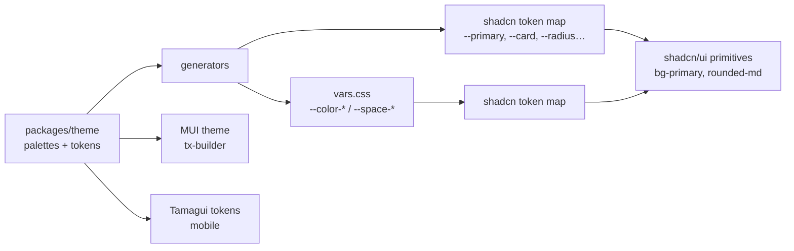
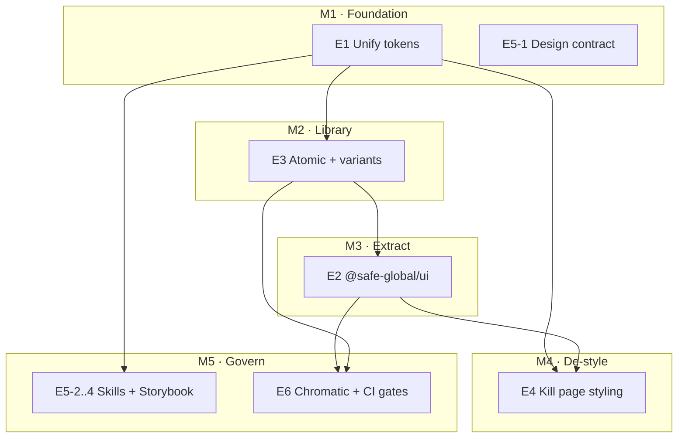

# Design System Extraction & Consolidation — Refactoring Plan

> **Status:** Proposal / planning artifact for the Wallet team.
> **Intended outcome:** One Linear **project** ("Design System Package") with **6 epics** and ~30 issues (drafts below).
> **Scope:** `apps/web` (and `apps/web-tanstack`) web design system. Mobile (Tamagui) and `tx-builder` (MUI) are explicitly out of the component scope — see [Cross-platform boundary](#cross-platform-boundary).
> **Author note:** This document is a plan only. No source code is changed by this file.

---

## 1. TL;DR

Safe{Wallet} web has **already migrated off MUI** — `apps/web` is now built on **shadcn/ui + Tailwind v4 + @base-ui/react** (56 primitives, 49 stories, 92% Storybook coverage, Chromatic live). The premise "move to only shadcn" is therefore **largely complete**. The remaining problem is not a migration; it is **consolidation, extraction, and governance**:

1. **Two disconnected token layers** drive inconsistency and dark-mode drift (the single biggest defect).
2. The component library is **trapped in `apps/web`** and cannot be reused by `apps/web-tanstack` (or future surfaces) without source-path hacks.
3. There is **no atomic structure, no variant catalog, partial `cva` adoption**, and a long tail of **ad-hoc page-level styling** (217 CSS modules, 221 local `styled.tsx`, 564 inline styles, 803 arbitrary Tailwind values).
4. There are **strong but ungoverned AI/designer workflows** (5 design skills, Figma Code Connect, Chromatic) that need a single canonical "design contract" so AI and humans stop diverging.

This plan unifies the tokens, extracts a `@safe-global/ui` package, imposes an atomic + variant-complete structure, eliminates page-level styling, and hardens the AI/designer guardrails so that **combining components is the only supported way to build UI**, and the result is consistent by construction.

---

## 2. Why now / the real problem (reframing)

The original brief assumes a MUI → shadcn migration with a dual-system problem. The codebase tells a different story:

| Assumption in brief | Reality found in repo | Implication |
| --- | --- | --- |
| "Dual UI system (MUI + shadcn)" | **0 `@mui/material` imports in `apps/web`.** MUI only survives in `apps/tx-builder` and as an unused generator in `packages/theme`. | Not a migration. It's **consolidation**. |
| "Make sure we only have shadcn" | 56 shadcn primitives, **1,672 files** import `@/components/ui/*`. shadcn is the de-facto standard. | The gap is **completeness + enforcement**, not adoption. |
| "Avoid styling in pages" | 217 `*.module.css`, 221 local `styled.tsx`, 564 inline `style={{}}`, 803 arbitrary Tailwind values (`w-[…]`, `h-[…]`). | Real, large debt. **Worth a dedicated epic.** |
| "Consistent design tokens / dark mode" | **Two parallel token systems** that disagree (see §4.2). | **Foundational fix — do this first.** |
| "Reuse the design system" | Library is coupled to `apps/web` (path aliases, `ShadcnProvider`, `@safe-global/utils`); `web-tanstack` reuses it via Vite source aliases, not a package. | **Extraction is needed for real reuse.** |

So the work is: **unify tokens → complete & structure the library → extract a package → kill page-level styling → govern it (AI + designer + CI).**

---

## 3. Goals & non-goals

### 3.1 Mapping the brief's 12 requirements to this plan

| # | Requirement (from brief) | Where addressed |
| --- | --- | --- |
| 1 | Extract design system to a reusable package | **Epic 2** (`@safe-global/ui`) |
| 2 | Only shadcn components; reuse (DRY); shadcn over raw HTML | **Epic 4** (de-styling) + **Epic 5** (lint guardrails) |
| 3 | Atoms / Molecules / Organisms architecture | **Epic 3** |
| 4 | Multiple variants; avoid per-page styling of buttons/cards/tables/toggles | **Epic 3** (variant completeness) + **Epic 4** |
| 5 | Default styling for all components/variants → combine to build consistent UI | **Epic 1** (tokens) + **Epic 3** (variant catalog) |
| 6 | AI must follow design rules and not "mess up" | **Epic 5** (canonical design contract, hardened skills, lint) |
| 7 | UI consistency across the app | **Epic 1** + **Epic 4** + **Epic 6** (Chromatic gate) |
| 8 | Dark mode consistency | **Epic 1** (single dark-mode mechanism) |
| 9 | Token consistency (radius, padding, margin, border, hover) | **Epic 1** (semantic token scale) |
| 10 | AI must extract all current patterns to understand them | **Epic 5** (`design.audit` skill + pattern inventory) |
| 11 | Designer changes the DS and sees it in Storybook | **Epic 1** + **Epic 6** (token pipeline → Storybook Foundations) |
| 12 | Designer prototypes screens in-app instead of Figma | **Epic 5** (`design.prototype` home + Storybook Prototypes section) |

### 3.2 Non-goals (explicit)

- **No MUI rewrite of `apps/tx-builder`.** It stays on MUI; it is a separate design-system boundary.
- **No attempt to share React/Tailwind components with mobile.** Mobile (Tamagui) shares only **tokens** via `packages/theme`.
- **No big-bang rewrite.** Every epic ships incrementally behind a green Storybook + Chromatic baseline.
- **No new design language.** We are codifying the *existing* (Figma "Obra shadcn-ui — safe") system, not redesigning it.

---

## 4. Current-state assessment (evidence)

### 4.1 The component library (`apps/web/src/components/ui/`)

- **56 primitives, 49 stories.** Built on `@base-ui/react`, `class-variance-authority` (cva), Tailwind v4, `cn()` (`apps/web/src/utils/cn.ts` = `twMerge(clsx(...))`).
- **Partial cva adoption (~60%).** Use cva: `button`, `badge`, `alert`, `toggle`, `chip`, `link`, `typography`, `field`, `input-group`. **Hardcode Tailwind (no cva):** `card`, `table`, `dialog`, `input`, `kbd`, `combobox`, `empty`.
- **Safe-custom (not upstream shadcn):** `chip`, `link`, `list`, `typography`, `empty`, `field`, `input-group`, `combobox` (MUI replacements / Safe additions). Only **4 have tests** (`chip`, `input`, `link`, `list`).
- **No barrel.** No `index.ts`; everything imported by path (`@/components/ui/button`).
- **No atomic structure.** Flat `ui/`. `components/common/` (108 components) holds *feature-specific* compositions, not reusable molecules.
- **Domain coupling.** `input.tsx` imports `@safe-global/utils/utils/addresses` (chain-prefix stripping) and does XSS sanitization — i.e., not purely presentational.
- **Portal scoping.** `ShadcnProvider` uses a `globalThis` singleton + `.shadcn-scope` wrapper so portals (dialog/combobox/popover) inherit scoped CSS vars.

### 4.2 The token problem (the headline defect)

Two parallel, **disagreeing** token layers live in `apps/web/src/styles/`:

| Layer | File | Source of truth | Selector for dark | Example |
| --- | --- | --- | --- | --- |
| **Safe palette** | `vars.css` (generated) | `packages/theme` (`lightPalette`/`darkPalette`, `spacingWeb`) | `[data-theme='dark']` | `--color-primary-main: #121312`, `--space-1: 8px` |
| **shadcn tokens** | `shadcn.css` (hand-authored / Figma-synced) | Figma plugin via `design.sync-variables` | `.dark.shadcn-scope` | `--primary: #171717`, `--radius: 1rem` |

`shadcn/ui` components only consume the **shadcn layer** (`bg-primary`, `text-card-foreground`, `rounded-md`). The Safe palette in `vars.css` is **not** what most components render. Concrete conflicts:

| Token | Safe (`vars.css`) | shadcn light (`shadcn.css`) | shadcn dark | Severity |
| --- | --- | --- | --- | --- |
| primary (brand) | `#121312` | `#171717` (generic) | `#12ff80` ✅ | **Critical** — light mode loses brand |
| secondary | `#12ff80` (Safe green) | `#f5f5f5` (gray) | `#262626` (gray) | **Critical** — completely different |
| radius | `6px` (`defaultRadius`) | `1rem` (16px) | — | **High** — corner radius inconsistent |
| warning | `--color-warning-*` | hardcoded `yellow-50/800` | hardcoded | **High** — bypasses palette |
| success | `--color-success-*` | bridged ✅ | bridged ✅ | OK (only one bridged) |

Plus **two dark-mode mechanisms** run simultaneously (`[data-theme='dark']` on `<html>` driven by `useDarkMode`, and `.dark.shadcn-scope` for Tailwind's `@custom-variant dark`). They can diverge.

**This is the root cause of "inconsistent UI / dark mode / tokens."** Until the shadcn token layer is *generated from* `packages/theme`, every other consistency effort is built on sand.

### 4.3 Page-level styling debt

| Escape hatch | Count (`apps/web/src`) | Target |
| --- | --- | --- |
| `*.module.css` files | 217 | Replace with components + tokens; keep only complex animations |
| Local `styled.tsx` wrappers | 221 imports | Fold into variants or molecules |
| Inline `style={{…}}` | 564 | Ban via lint (layout-only exceptions) |
| Arbitrary Tailwind (`w-[…]`, `text-[…]`) | 803 | Map to token scale |
| Hardcoded hex | 65 | Tokens only |

### 4.4 Tooling foundation (already strong — keep & harden)

- **Design skills (5):** `design.figma-to-code`, `design.prototype`, `design.sync-component`, `design.sync-variables`, `design.verify` (in `.claude/skills/`). They enforce "shadcn-only, Typography component, no custom colors, layout-only Tailwind."
- **Figma Code Connect:** 56 components mapped to Figma file `trBVcpjZslO63zxiNUI9io` ("Obra shadcn-ui — safe"); doc at `apps/web/src/components/ui/docs/figma-code-connect.md`.
- **Storybook (two configs):** `.storybook/` (Next/webpack, **canonical**) and `.storybook-vite/` (experimental). Addons: `@chromatic-com/storybook`, `addon-themes` (light/dark), `addon-designs` (Figma), `addon-docs`; MSW loader; Safe viewports.
- **Coverage tooling:** `scripts/storybook/*` → `apps/web/.storybook/COVERAGE.md` (823 components / 759 covered / 92%).
- **Chromatic:** live via `.github/workflows/web-chromatic.yml` (TurboSnap, manual dispatch, auto-accept on main) + local `test-runner.mjs` visual regression.
- **Prior spec:** `specs/001-shadcn-storybook-migration/` delivered the Storybook coverage; it **explicitly deferred** the actual refactor ("Out of Scope: Actual component refactoring from MUI to shadcn"). **This plan is that deferred work.**

---

## 5. Target architecture

### 5.1 Token pipeline (single source of truth)



**Key change:** `--primary`, `--secondary`, `--card`, `--radius`, `--border`, … become **derived aliases of the Safe palette** (`--color-*`), generated by `packages/theme` — not hand-authored. One semantic scale; one dark-mode mechanism.

### 5.2 Package layout

```
packages/
  theme/                      # tokens (unchanged role) — shared by web + mobile + tx-builder
  ui/                         # NEW @safe-global/ui — web-only shadcn primitives + patterns
    src/
      styles/                 # shadcn token layer (generated from theme) + base layer
      atoms/                  # primitives (button, input, badge, card, …)
      molecules/              # composed patterns (FormField, ButtonGroup, AddressItem, …)
      organisms/              # optional domain-aware compositions
      provider/               # ShadcnProvider, portal context
      index.ts                # barrel
    package.json              # peer: react/react-dom; deps: @base-ui/react, cva, tailwind-merge, clsx, lucide
  store/  utils/              # unchanged
```

- **Consumed as unbundled TS source** (matches `theme`/`store`/`utils`): `transpilePackages` (Next), Vite alias (web-tanstack), tsconfig `paths`. No new build step.
- **Tailwind stays in the app** (apps own postcss/tailwind config and import the package's generated CSS layer + `@source` the package).

### 5.3 Atomic taxonomy (recommended)

| Layer | Definition | Examples | Today |
| --- | --- | --- | --- |
| **Tokens** | Color/space/radius/typography primitives | `packages/theme` | exists |
| **Atoms** | Single-purpose primitives, fully variant-driven | Button, Input, Badge, Switch, Card, Typography | flat `ui/` |
| **Molecules** | 2–4 atoms combined into a reusable pattern | FormField, ButtonGroup, AddressItem, SearchInput, StatCard | scattered/inline |
| **Organisms** | Domain-aware compositions (still presentational) | TxRow, OwnerList, BalanceTable | in `common/`/`features/` |
| **Templates / Prototypes** | Page scaffolds & designer prototypes | `features/design-system/prototypes/*` | does not exist yet |

> Pragmatic note: if strict atomic naming is contentious, an equivalent `primitives / patterns / compositions` split is acceptable. The **important invariant** is: atoms have zero domain knowledge and live in `@safe-global/ui`; organisms may know domain types and may stay in the app.

### 5.4 Cross-platform boundary

| Layer | web | web-tanstack | tx-builder | mobile |
| --- | --- | --- | --- | --- |
| `@safe-global/ui` (Tailwind + base-ui) | ✅ | ✅ | ❌ (MUI) | ❌ (Tamagui) |
| `@safe-global/theme` (tokens) | ✅ | ✅ | ✅ (MUI gen) | ✅ (Tamagui gen) |

`@safe-global/ui` is **web-only**. Reuse benefit is web + web-tanstack today; the boundary keeps it honest.

---

## 6. Proposed Linear structure

**Project:** `Design System Package` (Wallet team).
**Milestones:** M1 Tokens unified → M2 Library complete & structured → M3 Package extracted → M4 Pages de-styled → M5 Governance & gates.

| Epic | Title | Milestone | Rough size |
| --- | --- | --- | --- |
| E1 | Unify the token system (single source of truth) | M1 | M |
| E2 | Extract `@safe-global/ui` package | M3 | L |
| E3 | Atomic structure + variant completeness | M2 | L |
| E4 | Eliminate ad-hoc page styling (DRY) | M4 | XL (incremental) |
| E5 | AI + designer governance (the design contract) | M1→M5 | M |
| E6 | Visual regression & CI enforcement | M5 | S |

Detailed issue drafts follow. Each issue is sized **S/M/L** and lists **Acceptance criteria (AC)**, **Dependencies**, and **Blast radius** (what could regress).

---

### Epic 1 — Unify the token system 🎯 (do first)

> **Why first:** every other consistency goal (dark mode, variants, "default styling") depends on one token source. Fixing this retroactively improves the whole app.

**E1-1 · Audit & map the two token layers** — *S*
- AC: A committed mapping table from every `shadcn.css` token (`--primary`, `--card`, `--radius`, …) to a `packages/theme` palette token (or "no equivalent → propose"). Flag all light/dark divergences and hardcoded values (`yellow-*`, hex).
- Deps: none. Blast radius: docs only.

**E1-2 · Generate the shadcn token layer from `packages/theme`** — *M*
- AC: Extend `packages/theme` css-vars generator to emit the shadcn alias layer (`--primary: var(--color-primary-main)` etc.). `shadcn.css` hand-authored colors removed; values come from the palette. `--radius` reconciled to the Safe radius scale. `yarn css-vars` regenerates both layers.
- Deps: E1-1. Blast radius: **app-wide visual** — every shadcn component re-colors. Requires Chromatic review (E6) and designer sign-off.

**E1-3 · Single dark-mode mechanism** — *M*
- AC: One switch drives both layers. Decide canonical mechanism (recommend: `.dark` class via `next-themes`/existing `useDarkMode`, with `[data-theme]` kept only if needed) and remove the redundant selector. Documented in the design contract.
- Deps: E1-2. Blast radius: **all dark-mode rendering**; verify `useDarkMode`, system-preference fallback, no-JS path.

**E1-4 · Define & document the semantic token scale** — *S*
- AC: Canonical scales for radius, spacing, border width/color, elevation/shadow, and **interaction states (hover/active/focus/disabled)** documented as tokens; "no arbitrary values" rule stated. Foundations page renders them in Storybook.
- Deps: E1-2. Blast radius: docs + a Storybook page.

**E1-5 · Point `design.sync-variables` at the unified source** — *S*
- AC: The skill updates the *generated* token source (or palette) rather than hand-edited `shadcn.css`; round-trip verified (Figma var change → regenerate → Storybook reflects it).
- Deps: E1-2. Blast radius: skill + designer workflow.

---

### Epic 2 — Extract `@safe-global/ui` package

> Sequencing choice (see §7): recommended **after** E3 stabilizes the API, OR extract a thin slice early to force the boundary. Either way these issues apply.

**E2-1 · Scaffold `packages/ui`** — *M*
- AC: `package.json` (`@safe-global/ui`, `workspace:^`, peer `react`/`react-dom`, deps `@base-ui/react`, `class-variance-authority`, `tailwind-merge`, `clsx`, `lucide-react`), `tsconfig` extending base, README. Wired into root tsconfig `paths`, Next `transpilePackages`, web-tanstack Vite alias, Turbo tasks (type-check/lint/test). Empty barrel compiles.
- Deps: none (can start in parallel with E1). Blast radius: build config.

**E2-2 · Relocate the CSS/token layer & decide scoping** — *M*
- AC: The generated shadcn token layer + base styles ship from the package (or `theme`); `@source` covers package paths so Tailwind sees package classes. `.shadcn-scope` scoping decision documented (keep vs. promote to `:root`).
- Deps: E1-2, E2-1. Blast radius: global CSS / Tailwind content scanning.

**E2-3 · Decouple primitives from app internals** — *M*
- AC: `input.tsx` domain logic (address prefix stripping via `@safe-global/utils`) moved to an app-level wrapper or injected prop — `@safe-global/ui` has no `@safe-global/utils`/`@/` imports. `ShadcnProvider` ships from the package. `cn` ships from (or re-exported by) the package. Barrel `index.ts` exports all atoms/molecules.
- Deps: E2-1. Blast radius: `input` consumers, portal-based components (dialog/combobox/popover), any `@/components/ui/ShadcnProvider` import.

**E2-4 · Codemod `apps/web` imports → `@safe-global/ui`** — *L*
- AC: All `@/components/ui/*` imports rewritten to `@safe-global/ui`. `components.json` aliases updated. Type-check, lint, unit, Storybook, Chromatic all green. No behavior change.
- Deps: E2-1..E2-3. Blast radius: **1,672 importing files** — mechanical but wide; rely on Chromatic baseline + full test suite.

**E2-5 · Consume `@safe-global/ui` from `web-tanstack`** — *S*
- AC: `web-tanstack` imports from the package instead of aliasing web source; its UI renders identically.
- Deps: E2-4. Blast radius: web-tanstack only.

---

### Epic 3 — Atomic structure + variant completeness

**E3-1 · Decide & document the atomic taxonomy (ADR)** — *S*
- AC: ADR fixing folder layout (atoms/molecules/organisms or primitives/patterns/compositions), placement rules (domain-free in package), and naming. Agreed by Wallet + design.
- Deps: none. Blast radius: docs.

**E3-2 · Standardize `cva` across all primitives** — *L*
- AC: Every primitive that varies (notably `card`, `table`, `dialog`, `input`, `kbd`, `combobox`, `empty`) exposes variants via `cva` with documented `variant`/`size` props. No visual change to existing usages (defaults preserved).
- Deps: E3-1. Blast radius: each refactored primitive's consumers — covered by stories/Chromatic.

**E3-3 · Build the molecule layer** — *L*
- AC: Extract the top reusable patterns currently duplicated in `common/`/`features/` into molecules (candidates: `FormField`, `ButtonGroup`/`IconGroup`, `AddressItem`, `SearchInput`, `StatCard`, `EmptyState`, `KeyValueRow`). Each has a story + variants. At least N (team-chosen) duplications removed.
- Deps: E3-1, E2 (or app-local first). Blast radius: refactored call sites.

**E3-4 · Auto-generate the variant catalog** — *M*
- AC: Script reads `cva` definitions and emits a `VARIANTS.md` + a Storybook "Foundations/Variants" page listing every component, variant, size. Runs in CI; drift fails the build (sibling to `COVERAGE.md`).
- Deps: E3-2. Blast radius: tooling.

---

### Epic 4 — Eliminate ad-hoc page styling (DRY / consistency)

**E4-1 · Inventory & categorize all styling escapes** — *S*
- AC: A generated report classifying the 217 CSS modules / 221 `styled.tsx` / 564 inline styles / 803 arbitrary Tailwind into: (a) replace-with-variant, (b) replace-with-molecule, (c) legitimate layout, (d) genuinely complex (keep). Prioritized by feature.
- Deps: none. Blast radius: docs.

**E4-2 · Phased replacement (per feature area)** — *XL, split per feature*
- AC: For each feature batch, CSS modules / inline styles / arbitrary values replaced by components + tokens; pixel-stable per Chromatic. (One Linear sub-issue per feature: dashboard, transactions, settings, balances, spaces, …)
- Deps: E1, E3. Blast radius: that feature's screens.

**E4-3 · ESLint guardrails** — *M*
- AC: Lint rules that fail on: inline `style={{}}` (except an allowlisted layout set), raw hex/`rgb()` in `className`/`style`, arbitrary Tailwind color/spacing values, and raw `<button>`/`<input>`/`<select>` outside `@safe-global/ui`. "shadcn-over-raw-HTML for semantic elements" encoded as a rule. Warn → error ramp.
- Deps: E4-1. Blast radius: dev DX; staged rollout.

---

### Epic 5 — AI + designer governance (the design contract)

**E5-1 · Author the canonical Design System contract** — *M*
- AC: `packages/ui/AGENTS.md` + a human `DESIGN_SYSTEM.md`: the token scale, the variant catalog (link), the atomic rules, "combine — don't style", dark-mode rule, and an explicit AI checklist ("never add hex; never arbitrary Tailwind colors; use Typography; use existing variant or propose a new one"). This is the single file AI and humans cite.
- Deps: E1-4, E3-4. Blast radius: docs.

**E5-2 · `design.audit` skill — extract & catalog current patterns** — *M*
- AC: A skill that scans the app and produces a pattern inventory (which components/variants/escapes exist where) so AI "understands" the system before changing it (brief requirement #10). Reuses E3-4/E4-1 outputs.
- Deps: E3-4, E4-1. Blast radius: tooling.

**E5-3 · Harden the existing design skills** — *M*
- AC: `figma-to-code`, `prototype`, `sync-component`, `sync-variables`, `verify` updated to (a) import from `@safe-global/ui`, (b) enforce the unified tokens + atomic layers, (c) reject hex/arbitrary values, (d) cite the E5-1 contract. `prototype` writes to the real `features/design-system/prototypes/` home.
- Deps: E1, E2, E5-1. Blast radius: AI workflows.

**E5-4 · Create the `features/design-system` home + Storybook sections** — *S*
- AC: `apps/web/src/features/design-system/{prototypes,stories}` created; Storybook gets top-level sections **Foundations** (tokens), **Atoms**, **Molecules**, **Prototypes**. Designers can prototype a screen entirely from existing components and view it live (brief requirements #11, #12).
- Deps: E5-3. Blast radius: Storybook nav.

---

### Epic 6 — Visual regression & CI enforcement

**E6-1 · Gate token/DS changes on Chromatic** — *S*
- AC: Chromatic runs automatically on PRs touching `packages/ui`/tokens/`styles`; visual diffs require designer approval before merge (the safety net for E1-2/E2-4).
- Deps: E2-1. Blast radius: CI.

**E6-2 · Coverage & catalog gates as definition-of-done** — *S*
- AC: New component in `@safe-global/ui` without a story or variant-catalog entry fails CI (extends existing coverage tooling).
- Deps: E3-4. Blast radius: CI.

---

## 7. Sequencing & phases



**Recommended order:** **E1 first** (tokens) — highest leverage, unblocks everything. Then **E3** (structure/variants) and start **E4** (de-styling) in parallel. **E2** (extraction) once the API is stable (or extract a thin slice early to force the boundary — see open decision OD-2). **E5/E6** are cross-cutting and ramp continuously; E6's Chromatic gate should be active before E1-2/E2-4 land because those are app-wide visual changes.

---

## 8. Risks & regression surface

| Risk | Likelihood | Mitigation |
| --- | --- | --- |
| E1-2 / E2-4 cause app-wide visual regressions | High | Chromatic baseline + required designer approval (E6-1); land behind feature parity, not redesign |
| Token unification changes brand colors in light mode (currently generic) | Certain (intended) | Treat as a designed change; get explicit designer sign-off on the new light palette |
| Dark-mode consolidation breaks system-preference / no-JS paths | Medium | Test matrix: forced light, forced dark, system, SSR/no-JS |
| Extraction breaks portals (dialog/combobox/popover) via `ShadcnProvider` singleton | Medium | Keep the `globalThis` singleton; integration-test portal components in package + app |
| `input.tsx` decoupling changes address-input behavior | Medium | Keep app-level wrapper with the existing util; unit tests for prefix stripping + sanitization |
| Codemod misses dynamic/`React.lazy` imports | Low | AST codemod + full type-check + Storybook build |
| Two Storybook configs drift | Low | Pick `.storybook/` canonical; decide fate of `.storybook-vite` (OD-3) |
| web-tanstack source-alias reuse breaks during extraction | Medium | E2-5 cutover + its own CI |

**Shared surfaces touched:** `packages/theme` generators, `apps/web/src/styles/*`, all `@/components/ui/*`, `ShadcnProvider`, `useDarkMode`, every feature that uses CSS modules/inline styles. Treat each epic's PRs with the repo's regression-checklist discipline.

---

## 9. Open decisions for the team

- **OD-1 — Package name:** `@safe-global/ui` (recommended) vs `@safe-global/design-system` vs merge into `@safe-global/theme` (not recommended — keeps tokens vs components separate).
- **OD-2 — Extraction timing:** stabilize-then-extract (E3→E2, less churn) vs extract-thin-slice-early (forces the boundary, more churn).
- **OD-3 — Storybook:** keep dual configs or commit to one (`.storybook/` canonical; decide `.storybook-vite` fate).
- **OD-4 — Atomic naming:** strict atoms/molecules/organisms vs pragmatic primitives/patterns/compositions.
- **OD-5 — Dark-mode canonical mechanism:** `.dark` class (Tailwind-native) vs `[data-theme]` attribute — pick one.
- **OD-6 — `.shadcn-scope` scoping:** keep the scoped wrapper or promote tokens to `:root` once unified.

---

## 10. Appendix

### 10.1 Key file references

| Concern | Path |
| --- | --- |
| Token source of truth | `packages/theme/src/{palettes,tokens,generators}` |
| Generated Safe vars | `apps/web/src/styles/vars.css` (via `apps/web/scripts/css-vars.ts`) |
| shadcn token layer | `apps/web/src/styles/shadcn.css` |
| Global CSS entry | `apps/web/src/styles/globals.css` |
| Primitives | `apps/web/src/components/ui/*` (56) |
| `cn()` | `apps/web/src/utils/cn.ts` |
| Portal provider | `apps/web/src/components/ui/ShadcnProvider.tsx` |
| shadcn CLI config | `apps/web/components.json` (`style: base-vega`, `cssVariables: true`) |
| Figma Code Connect | `apps/web/src/components/ui/docs/figma-code-connect.md` (file `trBVcpjZslO63zxiNUI9io`) |
| Design skills | `.claude/skills/design.{figma-to-code,prototype,sync-component,sync-variables,verify}/` |
| Storybook | `apps/web/.storybook/` (canonical), `apps/web/.storybook-vite/` (experimental) |
| Coverage report | `apps/web/.storybook/COVERAGE.md` (823 components / 759 covered) |
| Chromatic CI | `.github/workflows/web-chromatic.yml`, `apps/web/chromatic.config.json` |
| Prior (completed) spec | `specs/001-shadcn-storybook-migration/` |

### 10.2 Glossary

- **cva** — `class-variance-authority`; the function that maps a component's `variant`/`size` props to Tailwind class strings. The mechanism by which "default styling + variants" is encoded.
- **`@base-ui/react`** — the headless/unstyled primitive library shadcn builds on (accessibility, behavior).
- **Token layer** — the set of CSS custom properties components read (`--primary`, `--color-*`, `--space-*`).
- **`.shadcn-scope`** — wrapper class scoping the shadcn token layer; managed by `ShadcnProvider`.

---

*End of plan. Next step: turn §6 into a Linear project + epics + issues for the Wallet team (offered, not yet created).*
