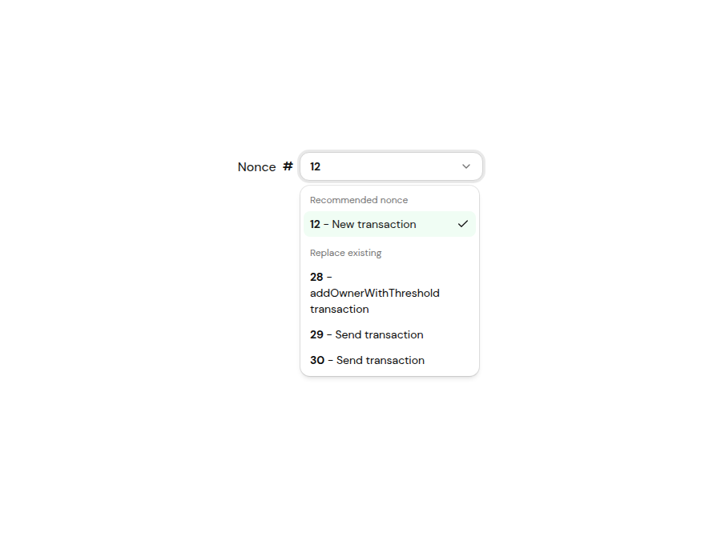
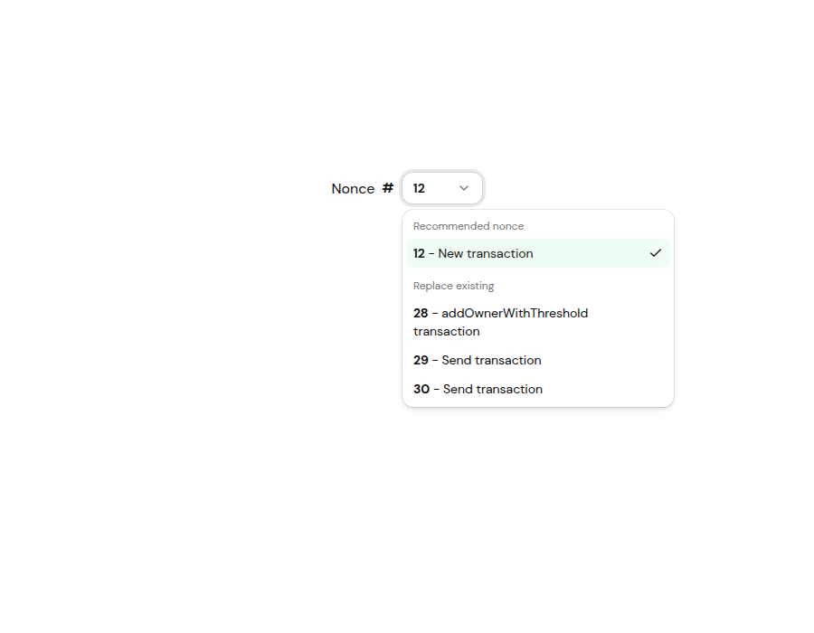
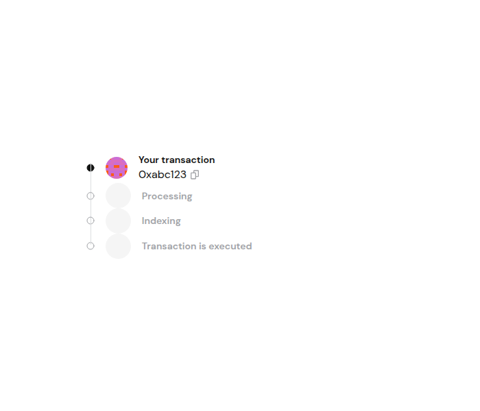
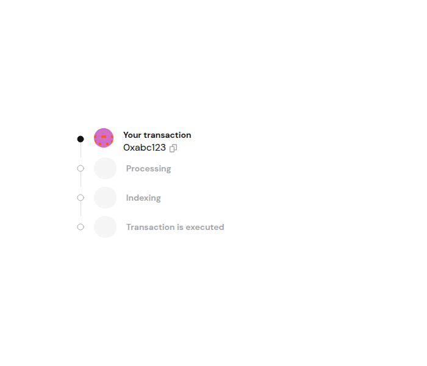
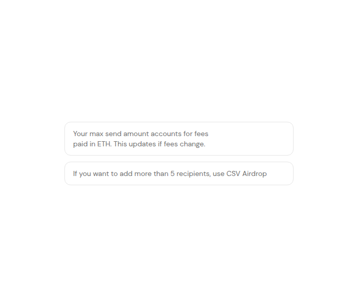
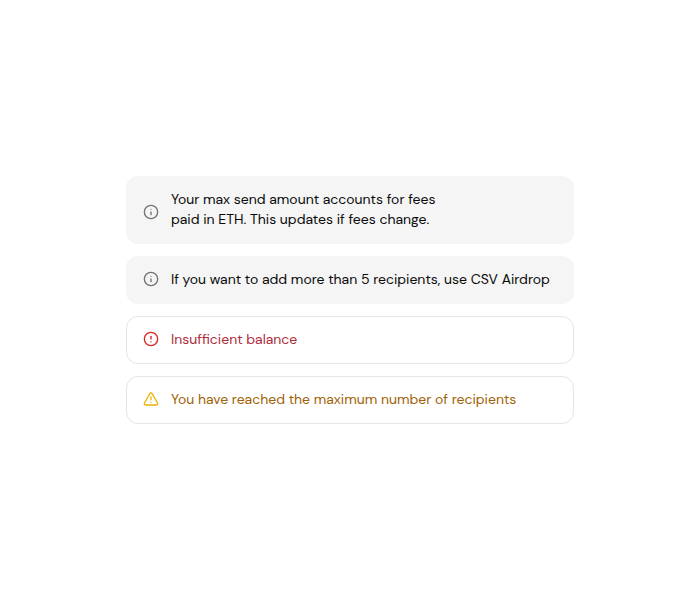

# Before / after — shadcn post-migration fixes pt. 3

Visual summary for [PR #8517](https://github.com/safe-global/safe-wallet-monorepo/pull/8517).

## Nonce field + dropdown

| Before                              | After                             |
| ----------------------------------- | --------------------------------- |
|  |  |

## Status stepper

| Before                                  | After                                 |
| --------------------------------------- | ------------------------------------- |
|  |  |

## Send funds banners

| Before                                  | After                                 |
| --------------------------------------- | ------------------------------------- |
|  |  |
